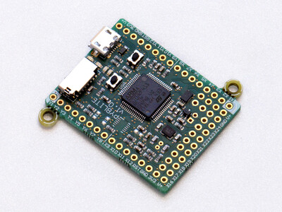
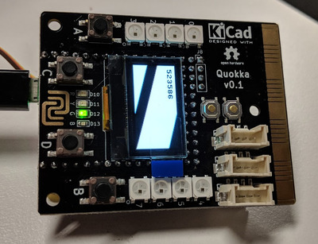
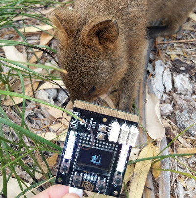

# Chapter 10 -- Pyboard, Quokka

The **pyboard** is another MicroPython-based microcontroller board. You can read more about it at [https://store.micropython.org/pyb-features](https://store.micropython.org/pyb-features). At NCSS we are using the Pyboard lite v1.0. The pyboard is developed by the author of MicroPython, Damien George.



It has much more ROM (to store your program), RAM (memory to run your program) and the CPU is much faster. Here's a comparison:

| | micro:bit | pyboard lite 1.0 |
| --- | --- | --- |
| ROM | 256kiB | 512kiB |
| RAM | 16kiB | 128kiB |
| CPU | 16 MHz | 96 MHz |

The **Quokka* is a board that was developed for NCSS. It's an expansion for the pyboard that adds:

* A 128x64 OLED display
* A micro:bit compatible radio
* 8 NeoPixel LEDs
* An accelerometer, compass, *and gyroscope*
* 4 buttons
* 4 single-colour indicator LEDs (red, orange, green, blue)
* 6 Grove connectors



### Uploading code to the pyboard

On the micro:bit, we program it by converting our Python code into a `.hex` file, then copying it onto the virtual USB drive created by the micro:bit. The pyboard takes this one step further -- we just put our Python files directly onto the virtual USB drive.

So when you connect a pyboard (with or without the Quokka expansion), a drive will show up named `PYBFLASH`, containing the following files:

* pybcdc.inf
* README.txt
* boot.py -- Configuration for the pyboard
* main.py -- Our program

We can actually edit main.py directly, but it's easier to work on a file named main.py somewhere on your computer, then copy that onto the pyboard when you want to program it.

When you do this, the **red** LED will turn on to indicate that data is being transferred. Don't reset or unplug the pyboard until the LED turns off again. Once the LED turns off, you can press the reset button (or send a reset command, see below) to start running your program.

You can also add additional files for your program to use. Any extra Python files can be imported as modules (just like regular Python). You can also store images or other program data.

### Programming on the pyboard

Although the pyboard also runs MicroPython, there are some differences in the way you write programs for it. The main one is that (of course) there is no `microbit` module. Instead you'll mostly use the `machine` (for access to pins), `pyb` (for access to pyboard-specific features), and `time` (for sleep) modules.

The other difference is that the pins are labelled differently. There are two sets of pins, `X` and `Y`, with 18 and 12 pins respectively. So for example, `X1` or `Y11`.

```python
import machine

# Set X1 to HIGH.
x1 = machine.Pin('X1')
x1.value(1)
```

There's a pyboard simulator at [http://micropython.org/unicorn/](http://micropython.org/unicorn/). You can try toggling a pin connected to a virtual LED by enabling the 'LED' peripheral (which is connected to pin `Y12`), then writing the following code:

```python
import machine
import time

y12 = machine.Pin('Y12')
for i in range(10):
  y12.value(0)
  time.sleep(0.5)
  y12.value(1)
  time.sleep(0.5)
```

*Note that on the pyboard, sleep is measured in seconds. If you want to sleep in milliseconds (like on the micro:bit), you need to use `time.sleep_ms`.*

To access the built-in LEDs, you can use the `pyb` module. They have a handy `toggle()` method (as well as `on()` and `off()`).

```python
import pyb
import time

red = pyb.LED(1)
for i in range(10):
  red.toggle()
  time.sleep(0.5)
```

The pyboard also has a single button, labelled `USR`, which allows you to check whether it's pressed using `value()`.

```python
import pyb
import time

red = pyb.LED(1)
btn = pyb.Button()

while True:
  if btn.value():
    r.on()
  else:
    r.off()
```

### Programming the Quokka

To make the Quokka more similar to the micro:bit, we've provided a `quokka` module that provides similar functionality to the `microbit` module. Like we've been doing on the micro:bit, you can use `from quokka import *`, or alternatively, `import quokka` then prefix everything with `quokka.`.

You can find some example programs at [https://github.com/jimmo/quokka/tree/master/py/demos](https://github.com/jimmo/quokka/tree/master/py/demos). In particular look at `maze_accelerometer.py` for a more complicated example of what is possible.

#### LEDs

```python
from quokka import *

red.on()
orange.on()
green.on()
blue.on()
```

or


```python
import quokka

quokka.red.on()
quokka.orange.on()
quokka.green.on()
quokka.blue.on()
```

#### Buttons

```python
from quokka import *

while True:
  if button_a.is_pressed():
    blue.on()
  else:
    blue.off()
```

We also provide a `was_pressed()` to match the micro:bit:

```python
from quokka import *

while True:
  if button_a.was_pressed():
    green.on()
```

There's `button_a`, `button_b`, `button_c`, `button_d`, and `button_usr`.

#### Sleep

To match the micro:bit, the quokka module provides a `sleep` method that takes milliseconds. It's equivalent to calling `time.sleep_ms`. These two code snippets are identical:

```python
from quokka import *
sleep(500)
```

```python
import time
time.sleep_ms(500)
```

#### OLED Display

The simplest way to use the OLED is to write text using `display.print`. (Note this is different to regular print which will go to the REPL/console like on the micro:bit).

```python
from quokka import *

while True:
  display.print('a: ', button_a.is_pressed())
  sleep(500)
```

The display can show 8 lines of text, 16 characters wide. It will scroll automatically.

You can clear the display using `display.clear`.

The other way to display text is with `display.text` which will allow you to place text anywhere you like on the screen. It takes the text to show, x and y coordinates, and optionally a colour (0 for white, or 1 for black, defaults to white), and a scale to size it (must be an integer, defaults to 1).

```python
from quokka import *

display.text('hello', 10, 10, scale=2)
display.show()
```

*Note: unlike `display.print` and `display.clear`, but like all the other methods we're about to see `display.text` requires us to `show` the display before the screen updates. (A bit like what we saw with NeoPixels).

To draw a rectangle, we can use `fill` (covers the entire screen) or `fill_rect`, which takes an x, y, width, height and colour.

```python
from quokka import *
# Make the display all white.
display.fill(1)
# Make a black box in the centre.
display.fill_rect(20, 20, 88, 24, 0)
```

#### Other display functions

The display also *inherts* all the method from MicroPython's `FrameBuffer` class, such as drawing lines, reading back pixel values, scrolling or blitting (copying areas). You can see the documentation for these functions at [https://docs.micropython.org/en/latest/library/framebuf.html](https://docs.micropython.org/en/latest/library/framebuf.html).

You'll need to call `display.show()` after using any of these methods.

```python
from quokka import *
display.line(0, 0, 128, 64, 1)
display.show()
```

#### Showing images on the display

If you have an image file (e.g. `.jpg` or `.png`) you can convert it into a format for the Quokka (`.qimz`) and store it to the pyboard's virtual USB drive. Your tutors will show you how to do this.

To load the image, you can use `Image.load`, e.g.

```python
from quokka import *

q = Image.load('quokka-46x64.qimz')
display.fill(1)
display.blit(q, 20, 0)
display.show()
```



You can access some sample images, including the one from the example above, at .

#### Accelerometer / Compass / Gyro

This works exactly like the micro:bit:

```python
from quokka import *

while True:
  display.clear()
  display.print(accelerometer.get_values())
  display.print(compass.get_values())
  display.print(gyro.get_values())
  sleep(200)
```

You can see the other methods available on these three objects (e.g. `get_x()` or some useful trigonometery) at [https://github.com/jimmo/micropython/blob/ncss-2019-quokka/ports/stm32/boards/PYBLITEV10-QUOKKA/modules/drivers/vector3d.py](https://github.com/jimmo/micropython/blob/ncss-2019-quokka/ports/stm32/boards/PYBLITEV10-QUOKKA/modules/drivers/vector3d.py).

#### Grove connectors

You can access the pins in the six grove connectors using `grove_a.pin0` and `grove_a.pin1` (for each of `grove_a`, `grove_b`, `grove_c`, `grove_d`, `grove_e`, `grove_f`). *Note that these are actually labelled on the board as `0`, `1`, etc...

#### Neopixels

Everyone's favourite feature! The quokka has 8 NeoPixels on board. We can use the neopixels in a similar way to the bit:bots.

```python
from quokka import *
import neopixel

# Use the neopixels on the quokka
n = neopixel.NeoPixel()
# Set the first one to red.
n[0] = (255, 0, 0)
n.show()
```

If you're plugging them in via the Grove connectors, you need to tell the neopixel object which pin the neopixels are connected to, and the number of neopixels in the strip.

```python
from quokka import *
import neopixel

# Connect 20 neopixels on pin 0 of grove connector A.
n = neopixel.NeoPixel(grove_a.pin0, 20)
n[0] = (255, 0, 0)
n.show()
```

On the Quokka version of the NeoPixel module, we also provide a helper for doing rainbow effects. By setting the pixel to just a single integer (rather than the usual R, G, B tuple), it will treat that as a hue and calculate the RGB automatically. The hue should be between 0 and 119. (e.g. 0 = red, 40 = green, 80 = blue, etc).

```python
from quokka import *
import neopixel

# Create a rainbow effect on the built-in NeoPixels.
n = neopixel.NeoPixel()
for i in range(8):
  n[i] = i * 14
n.show()
```

#### Radio

This works exactly as it does on the micro:bit:

```python
from quokka import *
import radio

radio.config(channel=22)
radio.on()

while True:
  if button_a.was_pressed():
    radio.send('hello')
  m = radio.receive()
  if m:
    display.print(m)
```

### More info

The board designs for the quokka are at [https://github.com/jimmo/quokka/tree/master/hardware](https://github.com/jimmo/quokka/tree/master/hardware).

The current MicroPython firmware is at [https://github.com/jimmo/micropython/tree/ncss-2019-quokka](https://github.com/jimmo/micropython/tree/ncss-2019-quokka) (adds the `BOARD=PYBLITEV10-QUOKKA` variant, the neopixel driver, and the quokka modules).

Some sample programs are at [https://github.com/jimmo/quokka/tree/master/py/demos](https://github.com/jimmo/quokka/tree/master/py/demos).
