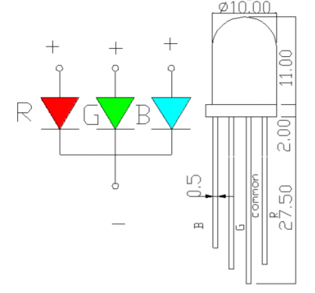
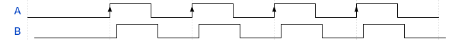
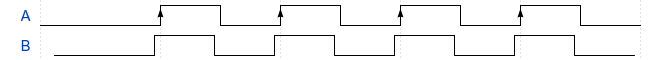

## About the labs

These lab exercises build on the concepts introduced in the lectures, and you can refer back to the chapters in this booklet for hints and more information. When you've finished a problem, sometimes it'll be really obvious that you've got it working, but many of them you might need to show a tutor.

Try to complete the exercises in order as most of the problems build on concepts from the previous problem. They're *hard* problems! We encourae you to work through them in pairs or groups, and please let us know if you'd like clarifications or help.

Some of the exercises are a quite open-ended and designed for you to explore the concepts and ask questions. Please take every opportunity to ask questions of the tutors and lecturers, and don't be afraid to ask questions about related concepts and ideas.

## Lab 1 -- Saturday morning

1. Complete the Grok *micro:bit Crash Course* up to the end of module **four** (i.e. up to the "Simple Snake" problem).

2. The Grok course will likely take most of the lab time, but here are some extension exercises:

2.1. Write a program that can detect *both buttons* being pressed at the same time, but with the same behavior as `was_pressed`. Unlike the *ATV Controller* problem, where your program detected that both buttons were currently pressed, instead we want to know if a press has happened (whether or not they are still being held down). Use this to write a program that counts the number of times that A was pressed, B was pressed, and A+B were pressed together.
For example, if the input sequence was **A**, **B**, **A**, **A+B**, **B**, **A+B** the program would print:
```
1 0 0
1 1 0
2 1 0
2 1 1
2 2 1
2 2 2
```

2.2. We want to use the micro:bit as a remote controller for lights in our house. We want the **A** button to control the kitchen lights, and the **B** button to control the living room lights. But we also want to be able to dim the lights, so we come up with this scheme:
 - Single press a button: turns on the lights if they're currently off, toggles between bright and dim if they're already on.
 - Double press a button: turns off the lights.
Use two of the LEDs in the display to represent the current state of the lights (off, dim, bright).

## Lab 2 -- Saturday afternoon

1. Complete the Grok *micro:bit Crash Course* up to the end of module **eight** (i.e. up to the "Roll the Dice" problem).

2. In the crash course we saw how connect an external button. As a tutor to get a Grove Adaptor and a button and try out your code from the "Dead Man's Switch" problem. We'll learn much more about these Grove components in later labs.
2.1. When we use external buttons, we only have `read_digital` to access the current state of the pin. This is kind of like `is_pressed`. Implement some code that emulates `was_pressed` for an external button (i.e. count the number of times the button was pressed, show this number on the display).

3. Ask a tutor for some LEDs. Wire them up using a breadboard, some grove->breadboard cable (in the bottom drawer of the component kits), and some current limiting resistors (also in the component kits).
3.1. Use `write_digital` (e.g. `pin0.write_digital(1)`) to control the LED.
3.2. We also have some RGB LEDs. These need to be wired up using three separate current limiting resistors. Make a program that cycles between red, green and blue.

The RGB LEDs are actually three LEDs (red, green, blue) together inside the bulb. They are "common cathode" which means they share a negative pin. Here's a picture from the datasheet that shows which pin is which.



3.2. What if you turn on the colours at the same time, figure out which combinations give you pink, cyan, yellow, and white. You might need to adjust the resistors to balance the brightness of the different colours.

4. Can you think of a way to adjust the brightness of the LED? *Hint: what if you turn the LED on and off really quickly?*
4.1. Use this to get other colours from the RGB LED.

## Lab 3 -- Sunday morning

#### Part 1 - Switches

For these tasks you will need:
- Grove button sensor
- magnet and Grove hall effect (magnet) sensor

1. Test that the button module works -- write a program to display a different image on the screen depending on whether a button module is currently pressed or not.
2. Try our your code from the [Dead Man's Switch](https://groklearning.com/learn/microbit-crash-course/6/2/) problem in Module 6 from the Grok Crash Course.
3. Use a button module, and write a program to count the number of times the button has been pressed (showing the count on the display using `display.show`).
   1. This is a bit tricky because there is no `was_pressed` for pins. You'll need to detect the **pin changing state** rather than just looking at whether it's currently pressed.
4. Make an automatic door opener that detects motion and opens the door. Show this by animating a door opening on the display of the screen.
5. Add a "lock" mode to your automatic door by adding a button module that disables the sensor if it has been pressed, press again to unlock.
6. Add a "card reader" that uses a magnet as a key-card to open the door even when locked.

!!Show your work to a tutor before continuing!!

#### Optional extension tasks
Most of these sensors behave a lot like the micro:bit buttons (especially the button module!). It'd be great if we could use the `is_pressed()` and `was_pressed()` functions like we can on the built-in buttons.

1. Write a class for each of the sensors that works like the `MicroBitButton` class. It should provide both an `is_pressed()` and a `was_pressed()` method (or equivalently, `is/was_motion()` and `is/was_magnet()`).
   1. *Hint*: you'll need to add another method that your program will need to call at the start of every loop that will actually read the state of the pin.
2. Try out one of the heart rate monitors. These work by sending a pulse for every beat detected (much like the motion sensors, but much shorter pulses). Ask your tutors for advice. Make the micro:bit flash the `Image.HEART` image for every beat and press a button to `display.show` the BPM.


#### Part 2 - Sound

For these tasks you will need:
- Grove sound sensor

This gives us the *volume* of the ambient sound in the room.

1. Write a program so that every time you clap your hands, the next image from a list of micro:bit images. It should start at the beginning of the list once the end is reached.
2. Instead of changing images, write a program to scale the brightness of Image.HEART so that the brightness scales with the sound emitted. It's possible to divide an image by a number to adjust the brightness:
```python
display.show(Image.HEART/1.5)
```
3. Write a program so scale the brightness of each pixel of *anything currently displayed* proportional to the volume detected by the sound sensor. *Hint* you should use `display.get_pixel` to get each pixel value and adjust the brightness by creating an *image string*.
   1. **Bonus**: write a function to turn one of your image strings into an `Image` object, so you can use divides like in your solution to the previous problem.

!!Show your work to a tutor before continuing!!

#### Part 3 - Rotary encoder

**Note**: You will need to *set* pull up resistors for this task at the start of your program

```python
# set the pull up resistors on each pin, in this example 2 & 15
pin2.read_digital()
pin2.set_pull(pin2.PULL_UP)
pin15.read_digital()
pin15.set_pull(pin15.PULL_UP)
```

The rotary encoder works by having 2 signals. The relative phase of the two signals can tell us if the encoder is turning clockwise, or anti-clockwise. Every time the encoder is turned, a pulse is sent, and we can look at the signals to figure out if it's clockwise, or anti-clockwise.

**The clockwise signal looks something like this:**



**The anti-clockwise signal looks something like this:**



Write a program to read from the encoder, and print 0 to 9 on the 5x5 LED on the micro:bit. If the number is greater than 9, it should be set to 0, similarly if it becomes less than 0, it should be set to 9.

!!Show your work to a tutor before continuing!!


### Part 4 -- PWM

1. Make an LED pulse on and off by smoothly changing the brightness up and down.
1.1. Try different pulsing patterns (e.g. sinusoidal).
2. Use an RGB LED to experiment with colours.
2.1. Generate a rainbow sequence, smoothly changing through the spectrum.


### Part 5 -- Servo motors

1. Use a standard servo to make a boom-gate style barrier that open and closes based on a signal from the micro:bit (e.g. when a button is pressed).

## Lab 4 -- Sunday afternoon

1. Complete the Grok *micro:bit Crash Course* up to the end of the course.

**Channel selection**: To ensure that everyone's using a different channel for their micro:bit, use the following formula to select a channel number for your programs.


Use the student number that you use when counting off in your groups.

2. Use a micro:bit as a remote control to activate the boom gate from the previous lab.

3. Experiment with the micro:bit radio. Build a test program to measure how far away you can reliably receive a signal.
3.1. Use the `radio.receive_full` method to get the RSSI (Received signal strength indication). This will give you an idea of how well the micro:bit is receving the signal. How does this value change with distance, relative orientation of the two micro:bits, or if the signal has to travel through walls.
3.2. How can you make your transmissions more reliable if some messages are lost? Try writing a program that sends messages multiple times and see if that improves the radio reliability?
3.3. Now that your sender is sending each message multiple times, how can the receiver tell whether it's received the same message more than once? Can you somehow identify the messages so that you can tell if they're duplicates at the receiver?

4. Most computer networks have a concept of a router, which is a device that can forward network messages to other devices. Write a program for a micro:bit that will act as a simple relay router that will resend any messages that it receives. See if you can use this to improve the range in your earlier experiments.

## Lab 5 -- Monday morning

### bit:bot line following

0. **Getting Started**:
    * Put some batteries in the compartment and plug in a micro:bit using the right-angle adaptor. As we have SONAR distance sensors installed on the fronts of these robots, you won't be able to plug them in directly.
    * Ensure that the power LED comes on, and that the micro:bit is powered by the batteries. You may have to write a short program that outputs something on the display to ensure this work, as we don't want to rely on the USB cable for this exercise.
    * Make the robot drive forwards.
1. Speed Control
    * Now that the bit:bot works, let's play around with the motors and speed controls a bit. First let's try making the bit:bot drive in a straight line. Does it work when both motors are set to the same power? Why or why not? Can you find some values that do make it move in a straight line? Write a function that makes the bit:bot drive forward with these speed values, it will be useful later on.
    * Write three functions that make the bit:bot turn 90-degrees clockwise, 90-degrees counter-clockwise and 180-degrees around.
    * Write a program that uses the previous functions you wrote and makes the bit:bot drive forwards for one second, spin around, and drive back to where it started. Did it work as you expected? What about if you upload the same code with no modifications to abother bit:bot.
2. Make your bit:bot detect when it's driven into a "garage" and stop automatically. i.e. the ambient light decreases
3. Make a simple radio-controlled car using the micro:bit radio and two micro:bits. When a button is pressed on the controller, toggle between two modes:
    * Driving forward at 100% speed.
    * Reversing in an arc to the left.
    Play a beep sound when changing modes.
    (This is how cheap radio-controlled car toys in the 90's worked as they only had a very simple radio that allowed for a single button!)
4. Improve the radio control to allow for four modes:
    - drive forwards (both buttons pressed)
    - turn left (left button only)
    - turn right (right button only)
    - stop (no buttons pressed)
5. The bouncing DVD logo is one of the more iconic screensavers of the early 2000s, and recently made a bit of a resurgence (for example: https://youtu.be/m8NAlDOCG6g). Let's try to recreate it with our bit:bots using the functions we wrote before and the line following sensors on our bit:bots.
    * To do this exercise you will need a rectangular area marked out with masking tape on the floor.
    * Before you get started, you can study how the screensaver looks here: https://bouncingdvdlogo.com/
    * **HINT**: You will need to use both of the line sensors to figure out which way your robot needs to turn when it hits an edge.
    * **EXTENSION**: Add colors to your bit:bot using the neopixels.
    * **EXTENSION**: Can you detect a rare corner-hit and play a sound if it happens?
6. Let's combine the radio controller and the line sensors! Make a circular-ish fenced off area for your bit:bot using masking tape. Using the line sensors, modify your radio controlled bit:bot such that it can't be driven out of its area.
    * **HINT**: you might want to make it spin around and move backwards whenever it hits the edge of the pen, otherwise it will just get stuck at the edge.


### bit:bot neopixels

1. Make your bit:bot indicate its left and right side like a boat or aeroplane. Turn on the front LED on the left to red, and the front neopixel on the right to green.
2. Update your line following program to add "indicators" to the bit:bot. Flash the left or right sides orange when turining left or right.
3. Make a rainbow pattern with the neopixels. Ask your tutors about HSV colour and how to convert to RGB.

### Ultrasonic distance sensor

1. Try out the example above. How accurate and precise are the measurements?
2. Experiment with some ways to improve the reliability of the sensor:
2.1. Calibrate the sensor with a ruler and update the speed of sound conversion factor and possibly add an offset.
2.2. Try creating a moving average of the sensor readings to reduce noise.

## Lab 6 -- Monday afternoon

### Line following

Today's lab focuses on closed-loop control. We're going to work on taking some of the tasks that we did in the previous lab with hard coded values and improve them to use feedback from the micro:bit and bit:bot sensors. Not only does that allow our code to be ported between different bit:bots, which might need different times/powers to move and rotate in the same way, but it will also mean our code runs a bit more reliably than before.

0. **Getting Started**:
    * If you didn't get around to it last lab, get your bit:bot working, make sure that the line following sensors work as you expect (use a small strip of masking tape on the floor).
    * Make sure that you are able to drive straight-ish, and make smooth curves to the left and right.

1. Let's start of with a simple line follower. Follow the bang-bang controller skeleton that's given in this chapter to follow a line on the floor.
    * When the *left* line sensor detects the masking tape, turn to the left.
    * When the *right* line sensor detects the masking tape, turn to the right.
    * When *both* or *none* of the line sensors detect masking tape, go straight.

    How well does this program do at following the line?

    * Change your program to arc to the left and the right, rather than turning sharply. Does this do any better?
        * Is there a situation where this approach will fail?

2. The simple bang-bang implementation, although effective, is not the fastest way we could follow the line. We can improve on this by counting the number of times the line sensor detects the masking tape and using this as an approximation for how far over the line we've gone.

    By doing this, we can make the robot make small corrections at first, and make larger and larger corrections if it comes to a sharp corner.

    * You can use the skeleton provided above to implement this.

3. **More Closed Loop Control**: We can also change the implementations for going straight and turning that we used in the previous lab to use closed loop control. This will allow our code to be far more portable than before.
    1. Using the compass sensor on the micro:bit, make a program that travels straight, adjusting the left and right motor powers whenever the heading changes.
        * *HINT*: The example code for the PI controller may be helpful here
    2. Modify your code so that it is able to drive straight for exactly 1, 2 and 4 seconds.
    3. Write some code to turn 90 degrees clockwise/counterclockwise.
        * *HINT*: You may have to slow down when you approach the correct heading to ensure you don't overshoot. Can you use the difference between the current heading and target heading to select a speed? What sort of control algorithm would this be?
    4. Use this code to drive forwards for 1 second, rotate 180 degrees, and drive forwards for 1 second. Did it do better than before? What about if you upload the same code to another bit:bot with no modifications?

#### Bit:Bot Challenge

Once you've completed the above lab exercises, there are a couple of additional challenges that will require you to combine all the concepts you've covered thus far.

We've set up two (hidden) courses somewhere in the building. Your challenges, should you choose to accept them, are given below...

1. **The Obstacle Course**

    Now that you've got your line following robots working it's time to deploy them in the field. Of course, the real world is never as neat as the lab, so you'll have to make sure your robot can handle a bit of noise.... Your robot will have to handle the following things:

    * angular turns
    * steep curves
    * overlapping lines
    * rough surfaces

    Finally at the end of the course, your bit:bot will drive into a box. Your robot should detect that this has occured using the top-mounted light sensors and stop at the end.

2. **The Time Trial**

    One advantage of moving from a bang-bang controller to a PI style controller is that we spend a lot more time driving forwards. The better our control algorithm, the faster we can go! Unfortunately, as you will soon discover, speed does come at the expense of stability, so your challenge here will be to push your robot to complete our obstacle course as fast as you can.

    Although not as sharp as for challenge 1, the course will still have some steep curves that you will need to handle.


## Lab 8 -- Thursday morning

This is the final lab before the project. You can also use this time to catch up on any previous labs that you haven't finished.

1. Use the Mu plotting mode to plot the data from one of the axes of the accelerometer.
1.1. With one battery powered micro:bit, read the data from the accelerometer and send it via radio to another micro:bit that is connected to Mu. Use this to plot the accelerometer data as you walk around the room, or do various activities such as jumping or running. What patterns can you see?

2. Update the reaction time game from chapter 4 to save the best time to a file on the filesystem. Print out `"Time to beat: "` and the time when the program starts up.

3. Explore the features on the Quokka board.
3.1. Use the display to show some text and show which button is currently being pressed.
3.2. Make the neopixels show a scrolling rainbow pattern (or pattern of your choice!).
3.3. Use a micro:bit talking to the Quokka via radio to control the neopixels.
