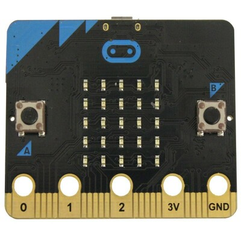
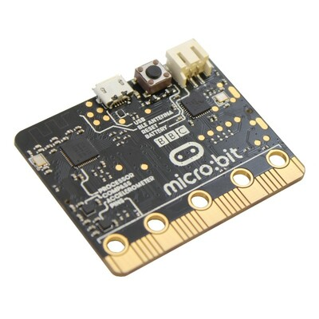
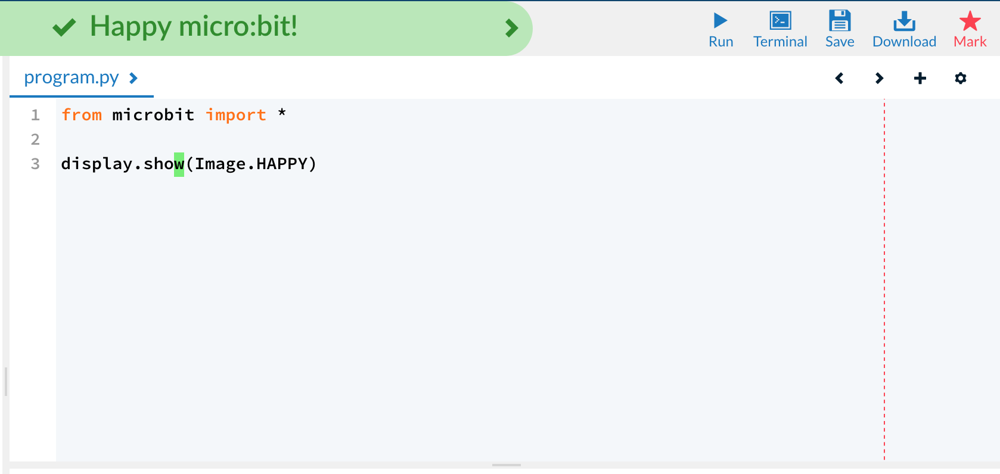
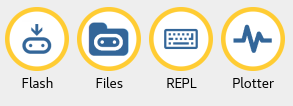
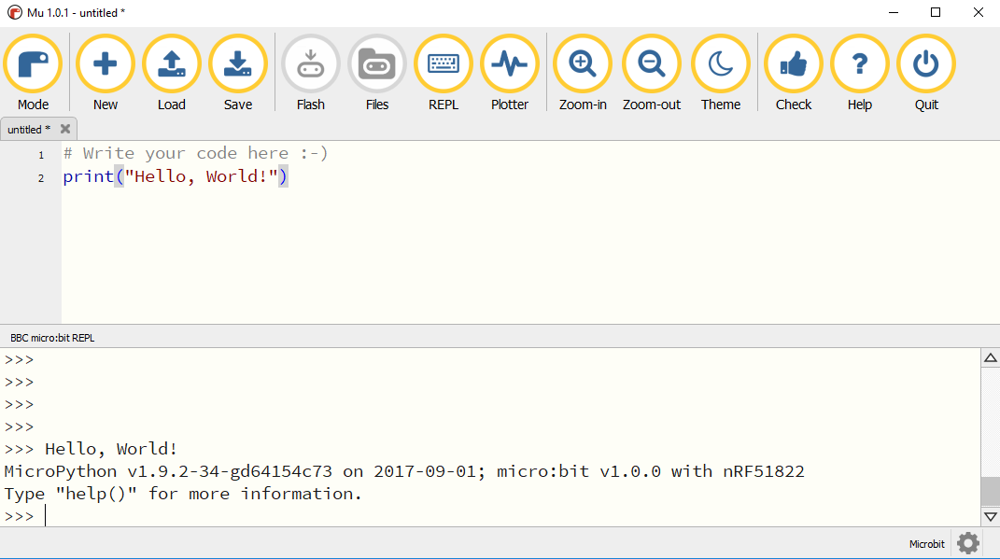
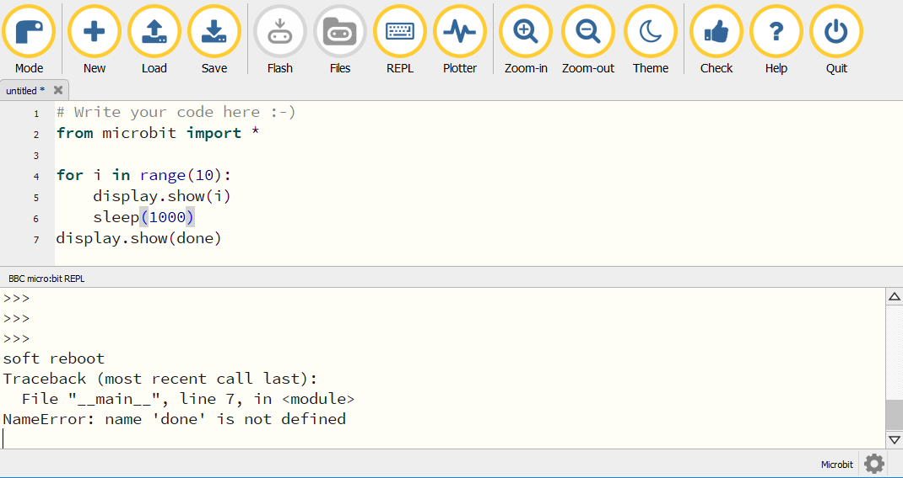

## Chapter 2 -- micro:bit basics

The BBC micro:bit is a small, handheld, embedded microcontroller, which we will be using for the duration of the camp. Apart from being very friendly, it has a huge number of peripherals that we can use: a compass, an accelerometer, a thermometer, a radio for chatting between 2 micro:bits, two buttons and a 5x5 display. More importantly, it can run Python! The aim of the next few days will be to get up to speed on the various features of the micro:bit.

 

To get started we're going to be working through the [micro:bit Crash Course](https://groklearning.com/course/microbit-crash-course/) on the Grok Learning platform. For those of you who have done the NCSS Challenge, this will be a very familiar interface, with the key difference that our code will now be running on an emulated micro:bit in the browser.

The crash course will go through everything you need to play around with the micro:bit, as well as getting you up to speed on Python. In addition to the course, we give a brief description of the peripherals of the micro:bit below, and go through some key Python concepts, which you can use as a reference if you ever get stuck.

### Getting Started

If you're using the micro:bit emulator on Grok, you don't need anything more to get started.

If you're playing around with a real micro:bit, you'll need a couple of other things to get going. When you plug the micro:bit in to your computer, it will show up as a drive connected to your computer. The micro:bit expects you to copy a `.hex` file which contains the compiled program that you want to run.

There's a couple of ways to get this file. If you are using the Grok interface to write your programs, you can hit the "Download" button in the top right corner of the editor to download the hex file that corresponds to your written program. Then, copy and paste that file onto the micro:bit drive that appears.


Alternatively, you can use the `Mu` editor -  a simple editor for Python that interfaces directly with the micro:bit, and is able to upload code directly to the micro:bit. During the micro:bit labs, this will be the main editor we use. The editor can be downloaded from https://codewith.mu/en/. By pressing the `Flash` button in the editor, we can upload the code to the micro:bit. Once the upload is completed, the micro:bit will automatically reset and start running your new program.


**Note**: If this set of buttons doesn't appear in your copy of `Mu`, you may not be running in the "micro:bit" mode. You can change the target in `Mu` by pressing the `Mode` button in the top left corner of the editor.

### Using the micro:bit

Plug your micro:bit into the computer with a USB cable, open up `Mu` and let's start coding!

#### Our first program (variables, the micro:bit display and sleep)

Let's turn on the display!

```python
from microbit import *

# Show an image on the 5 x 5 display
display.show(Image.HAPPY)
```

What's happening here? The first line is to `import` the microbit module, which gives us all the functions we're going to use.

The third lins is a comment line. In Python, all comments start with a `#` character and allow us to add some descriptive text to our code.

`display.show` is a function that displays an image, `Image.HAPPY`. It looks like a happy face :)

There are a long list of in-built images [on the microbit documentation](https://microbit-micropython.readthedocs.io/en/latest/tutorials/images.html).

To show multiple images, we need to `sleep` in between instructions, because the micro:bit runs so fast that the images will flash faster than our eyes can see them if we don't do this.

The parameter of `sleep` is in *milliseconds*, so `sleep(1000)` means *sleep for 1 second*. So someone's life story told in 3 seconds might look like this:

```python
from microbit import *

# Show an image on the 5 x 5 display
display.show(Image.HAPPY)
# Wait for a number of milliseconds
sleep(1000)
display.show(Image.SAD)
sleep(1000)
display.show(Image.SKULL)
sleep(1000)
display.clear()
```

In the above code, we are sleeping for 1 second after each image. If we wanted to change this time, we would have to change our code in 3 different places. Rather than write our code like this, we can store the amount of time we want to sleep in a variable, and reuse that value multiple times in our code:

```python
from microbit import *

# Set the wait time
wait_time = 2000

# Show an image on the 5 x 5 display
display.show(Image.HAPPY)
# Wait for a number of milliseconds
sleep(wait_time)
display.show(Image.SAD)
sleep(wait_time)
display.show(Image.SKULL)
sleep(wait_time)
display.clear()
```

Now, we can change all of the the delay after each of the images while only changing a single number in our code!

#### Working with the display

The `display` module does more than just setting pre-built images. It's also possible to individually control each LED, including making them brighter and darker. We can programmatically do this with the `display.set_pixel` function.

The display works on a grid with `(0, 0)` at the top left of the display:


For example, to control a single pixel we can write:

```python
from microbit import *

display.clear()
#set_pixel(x,y,brightness)  3rd light across and 4th down because we count from 0
display.set_pixel(2, 3, 9)
```

The above code will do two things. First it clears the display, getting rid of any previously displayed image. Then, since each pixel has a brightness from `0` to `9`, the code above sets pixel (2, 3) to full brightness.

As another example the code below will turn off the previous pixel, and light up the middle pixel at half brightness instead:

```python
from microbit import *

display.set_pixel(2, 3, 0)
display.set_pixel(2, 2, 5)
```

#### Working with Text

We can also use the `display.show` function to print out some text:

```python
from microbit import *

# Show text on the 5 x 5 display one letter at a time
display.show('Hi NCSS')
```

But that flashes letters and it ends up being a bit hard to read. Much better to `scroll` text instead:

```python
from microbit import *

# Scroll text on the 5 x 5 display
display.scroll('Hello there, this text is scrooooooolling')
```

Much like with numbers above, we can also store **strings** (that is text data) in variables as well.

```python
from microbit import *

text_data = 'Hello there, this text is scrooooooolling'
# Scroll text on the 5 x 5 display
display.scroll(text_data)
```

Whenever we want to store text data, we need to wrap it in either `'`, or `"` characters. This tells Python that the data that follows should be stored as text and not interpreted. We can also add different strings together in order to make longer strings. For example, to print our name we might write code that looks like:

```python
name = "Sebastian"
display.scroll("Hi " + name + ". Welcome to NCSS!")
```

This code will scroll `Hi Sebastian. Welcome to NCSS!` across the screen.

One final caveat to keep in mind, text and numbers behave differently. By wrapping strings in `'` or `"` characters, we're telling Python that values stored there should be treated as text.

For example, in the below code:
```python
text_data_1 = "1"
text_data_2 = "2"
final_value = text_data_1 + text_data_2
```
the value stored in `final_value` will be `"12"`, and not `3`, since we've told Python that both of those values are strings.

We can convert from strings into numbers by running the `int` function on the text. If our code was instead:
```python
final_value = int(text_data_1) + int(text_data_2)
```
the values stored in `text_data_1` and `text_data_2` are converted to numbers before being added, so final value after running this code will be `3`.

We can also do the opposite conversion, taking a number variable and turning it into text. For example:
```python
number_data_1 = 1
number_data_2 = 2

final_value = str(number_data_1) + str(number_data_2)
```
In this case, final value will be `"12"` as before.

#### More scrolling

To scroll integers, we need to convert them to a string using the `str` function before scrolling:

```python
from microbit import *

num = 50
# Scrolling text with joining
display.scroll('The answer is: ' + str(num))
```

We might want to repeatedly scroll text:

```python
from microbit import *

# Scrolling text with repetition
display.scroll('LOLOLOLOLOLOLO', loop=True)
```

That text will keep repeating, to speed it up we can use the `delay` *key word argument* (called a kwarg).

```python
from microbit import *

# Scrolling text with repetition and change of speed
display.scroll('LOLOLOLOLOLOLO', delay=50, loop=True)
```

The `delay` specifies the delay in *milliseconds* between each frame.

Find more info on scrolling text in the [docs](https://microbit-micropython.readthedocs.io/en/latest/display.html?highlight=scroll#microbit.display.scroll). Lots of those options are available in `display.show` too!

#### The REPL

In addition to uploading scripts to the micro:bit and running them, we can also interactively run single lines of Python code on the micro:bit. The easiest way to access the REPL on the micro:bit is using the `Mu` editor, where we can press the `REPL` button in the menu bar. This will stop the currently running program and bring up a prompt, into which you can type Python expressions.

*Note: REPL stands for "Read, Evaluate, Print, Loop"*

For example, try bringing up the `REPL` and type the following lines:

```python
>>> display.show(Image.HAPPY)
```

Opening the `REPL` causes whatever code is uploading to stop, however we can also restart our running code, either by pressing the "reset" button on the micro:bit, or pressing `<Ctrl-D>` in the `REPL` window.

Note, you won't be able to upload code to the micro:bit while the `REPL` window is open. If you want to upload a new program, you will have to close the `REPL` window first.

#### Printing to the console

It's annoying to try and look at a scrolling error message on the LED display. Instead of printing to the display, we can output straight to the `REPL` window. Upload the following code to your micro:bit.

```python
# Output text to the console
print('Hello, World!')
```

That will print messages to the serial console so you can get an actual output, to do some debugging. In Grok, look at the "Output" tab to view the serial output in the simulator. In `Mu` to see what the output looks like, you can open the `REPL` window, and either hit the "reset" button on your micro:bit or press `<Ctrl-D>` in the `REPL` window to start your program going again. Your message will show up in the window:



If we want to print a number inside of a string, we need to convert that number into a string:

```python
answer = 42
print('The answer to life the universe and everything is ' + str(answer))
```

#### Using loops

Embedded systems, we generally don't want them to stop. So we really want them to do things *forever*. Let's take a look a program that does this:

```python
from microbit import *

# Run this animation forever
while True:
    display.show(Image.HEART)
    sleep(500)
    display.show(Image.HEART_SMALL)
    sleep(500)
```

The `while` loop is a language feature we can use to do this. It comes in the form `while <condition>:`, when the `condition` evaluates to `True` then the loop repeats. At the beginning of each loop, the `condition` is checked to see if the loop continues. The code that we want to run is indented to indicate that it is all part of the `while` loop. Un-indented code will not be run as part of the loop. For example, in the following code:

```python
while True:
    print("Hello, World!")
    sleep(500)
print("Goodnight, Moon.")
```

The phrase "Hello, World!" will be printed indefinitely, while "Goodnight, Moon." will never be reached.

In addition, in both the above loops, since `True` is always `True` (duh...), the above code will repeat forever. It is an *infinite loop*.

We can also write a loop that will terminate once a certain action has taken place. For example, in the following code:

```python
i = 0
while i < 5:
    print("The number was: " + str(i))
    i += 1
print("Done")
```

the condition `i < 5` is true until i = 5, so this code will print:

```
The number was: 0
The number was: 1
The number was: 2
The number was: 3
The number was: 4
Done
```

#### Buttons and if statements

The `microbit` module gives us `button_a` and `button_b` objects to use the buttons.

To simply see if the button is pressed down right now, use the `is_pressed()` function, as the name would imply.

```python
from microbit import *

# Show a heart while the button is pressed
while True:
    display.clear()
    if button_a.is_pressed():
        display.show(Image.HEART)
    sleep(1000)
```

Notice the use of the `if` statement. Like the `while` loop, the `if` statement will check whether the condition is true, and run the indented code if it is. In the above code, `display.show(Image.HEART)` is run if `button_a.is_pressed()` is true. Since `sleep(1000)` isn't indented relative to the `if` statement, it will always be run.

We can connect an `if` statement with an `else` statement, which will run if the condition evaluates to

```python
from microbit import *

while True:
    if button_a.is_pressed():
        display.show(Image.HEART)
    else:
        display.show(Image.GHOST)
```

The `elif` statement lets us add even more options!

```python
from microbit import *

while True:
    if button_a.is_pressed():
        display.show('A')
    elif button_b.is_pressed():
        display.show('B')
    else:
        display.clear()
```

What would happen here is both `button_a` and `button_b` are pressed?

#### Was it pressed?

While the `is_pressed()` function will tell us whether a button is currently being pressed, often what we want to do is check whether a button was pressed at some point in the past. For this purpose we have the `was_pressed()` function

The `was_pressed()` checks: between this time and the last time we checked, was the button pressed? One thing to remember: the `was_pressed()` function will return `True` ONCE for a button press. If we run it again without releasing the button, it will subsequently return `False`.

For example, we can write a simple counter like so:

```python
count = 0
while True:
    # Show the current count, and increment it
    display.show(count)
    count += 1
    # If button a was pressed at some point, reset the count
    if button_a.was_pressed():
        count = 0
    # Wait 1 second before continuing
    sleep(1000)
```

If we were to replace `was_pressed` with `is_pressed`, we wouldn't be able to detect any button presses that occurred during the sleep. In other words, we would have a pretty rubbish reset button....

#### Lists

So far, we've stored both strings and numbers in variables, in Python we can also store lists of values. To create a list, just as we wrap strings in quotes (`"`), we wrap lists in square brackets (`[`). Let's create a list of the first 10 prime numbers:

```python
primes = [2,3,5,7,11,13,17,19,23,29]
```

We can access values inside a list by indicating its position inside square brackets. Note that in Python, and indeed in almost all programming languages, the positions of values starts from 0. To add the first two prime numbers together we can write:

```python
first_two_primes = primes[0] + primes[1]
display.scroll(str(first_two_primes))
```

We can also add and remove items from a list. To add a few more primes into our list we can use the `append` function:

```python
primes.append(31)
primes.append(37)
```

To remove primes from the list, we can use the `remove` function if we know which value we want to remove, or the `pop` function if we know its position.

```python
primes.pop(0) # Remove the first prime number
primes.remove(11)
```

After these two lines, our list will contain: `[3,5,7,13,17,19,23,29,31,37]`. If we're ever in any doubt, we can print the list to the console, which will give you the contents of the list:

```python
print(primes)
```

We can also always get the length of a list using the `len` function, which will return the number of items in a given list as a number:

```python
list_length = len(primes)
print("The number of primes I know is: " + str(list_length))
```

There are more things that we can do with lists that are documented in the Python language. When you have a chance you can find this documentation at: https://docs.python.org/3.4/tutorial/datastructures.html. Note that this also includes some additional data structures that you might find helpful later on.

#### The for loop

Aside from `while` loops, Python also allows us to loop over lists of things. For those of you that have done some programming before, this is a `for-each` type loop, that is different from the `for` loops you may have seen in other languages.

The syntax for a for loop is:
```python
for <variable> in <list>:
    # do something with each value
```

This loop will loop over each value in the given list, and put the value into the variable given.

For example, if we are working with the list of primes we made before, we can do something like:
```python
for prime in primes:
    print("One of the primes I know is: " + str(prime))
```
This will print out each of the primes that is in the list.

#### The `range` function - counting in a loop

One of the really common patterns that we run into when we're coding is we want to loop up to a certain number of times. In the above code, we used a while loop to accomplish this.

```python
i = 0
while i < 5:
    print("The number was: " + str(i))
    i += 1
print("Done")
```

Now that we know about the `for` loop, we can simplify this code quite a bit by using a list and a `for` loop:
```python
for i in [0,1,2,3,4]:
    print("The number was: " + str(i))
print("Done")
```

This will print out exactly the same count as before, but we can do even better using the `range` function, which creates a list of numbers for us, rather than requiring us to do it manually:
```python
for i in range(5):
    print("The number was: " + str(i))
print("Done")
```

We can use these loops like this to replace most code that requires a range of values to be used. For example, if we wanted to turn on the fourth row of the micro:bit display we can write:

```python
from microbit import *

for x in range(5):
    display.set_pixel(x, 4, 9)
```

The equivalent code is:

```python
from microbit import *

display.set_pixel(0, 4, 9)
display.set_pixel(1, 4, 9)
display.set_pixel(2, 4, 9)
display.set_pixel(3, 4, 9)
display.set_pixel(4, 4, 9)
```

but that's pretty boring to write (and more error-prone). So use a `for` loop instead.

**Note**: The range function can actually do a whole lot more than count from `0` to `n`, you can set start, and step values too. If you're curious, the full documentation is available here: https://docs.python.org/3.4/library/stdtypes.html#range

#### Functions
So far we've been using lots of functions in Python like `sleep` or `print`. These functions are *defined* by someone else, and we can just call that function to use it.

But you can also write your own functions just like these ones!

Say we just wanted to show the `HAPPY` image, sleep for 1 second, the clear the display.

```python
from microbit import *
def happy():
    display.show(Image.HAPPY)
    sleep(1000)
    display.clear()

happy() # Call the function
```

The `def` keyword *defines* the function `happy`, and calling the function by using the name and parentheses (in this case `happy()`), runs the lines of code inside the function.

It's possible to send information into a function, via a *parameter* or *argument* (sometimes we abbreviate this and call it an **arg**). Let's look at an example:

```python
from microbit import *
def happy(ms):
    display.show(Image.HAPPY)
    sleep(ms)
    display.clear()

happy(300) # Call the function, sleep for 300 ms
happy(500) # Call it again, sleep for 500 ms this time
```

Here we defined that there is a parameter to the function `happy` called `ms`, and each time we call this function, we use the value of that is passed for `ms`. In the above example, the first time we call `happy`, `ms` is set to `300`, the second time we call `happy`, `ms` is set to `500`.

We can also get information back from functions by using the `return` statement. For example, we can write a function that converts from celcius to farenheit.

```python
from microbit import *

# Conversion functions for C->F and F->C
def celcius_to_fahrenheit(c):
    farenheit = c * 9 / 5 + 32
    return farenheit

# Shows the current temperature in C and F
def show_temperature():
    c = temperature()
    f = celcius_to_fahrenheit(c)
    print("micro:bit temperature in celcius: " + str(c) + "C")
    print("micro:bit temperature in farenheit: " + str(f) + "F")

# Update the temperature once per second
while True:
    show_temperature()
    sleep(1000)
```

#### Debugging Your Code

Apart from being a great way to quickly test out the functionality of the micro:bit, the `REPL` also allows you to find errors in your code. For example, let's upload this buggy code to our micro:bit.

```python
from microbit import *

for i in range(10):
    display.show(i)
    sleep(1000)
display.show(done)
```

This above code has an error in it, we've forgotten to put quotes around the string `done`. As a result it will crash once it finishes counting to `10`. The micro:bit will scroll the error message across the display, however this is usually slow and difficult to read.

We can get the same information by opening the `REPL` and restarting our program, either by pressing the "reset" button on the micro:bit, or by pressing `<Ctrl-D>` in the `REPL` window. Once we run into the error, the full error message will be output to the console.



### Where to go from here

Although we've covered a heap of content here, there are far more features available in both Python and micro:bit than we can cover here. If you would like more information, you can:

* The micro:bit documentation for features of the micro:bit https://microbit-micropython.readthedocs.io/en/latest/index.html
* The MicroPython documentation http://docs.micropython.org/en/latest/
* The Python documentation https://docs.python.org/3.4/reference/index.html

    Note that although MicroPython is based on Python 3.4, there are a number of differences. The Python documentation is excellent at describing the built-in functions, and most of what you will find there is valid for MicroPython as well, there are some differences, that you can read about here: http://docs.micropython.org/en/latest/genrst/index.html
