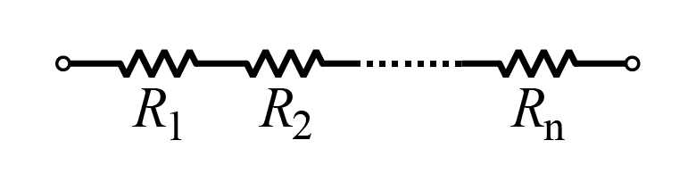
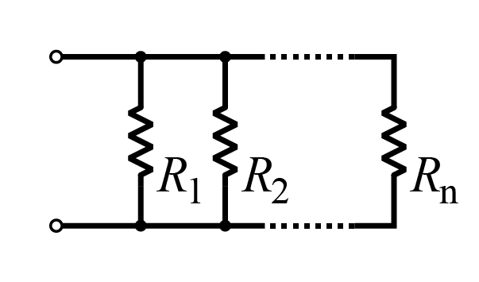
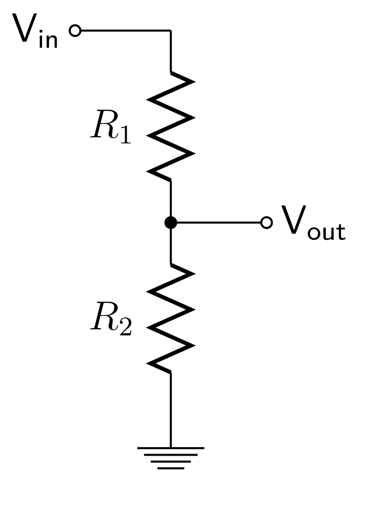
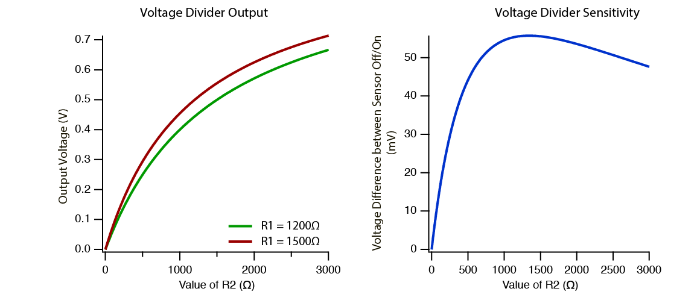
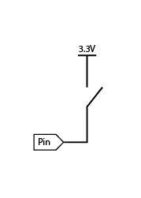
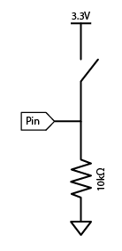
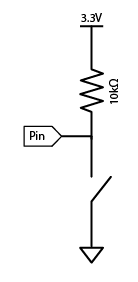
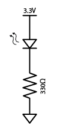

# Chapter 3 -- Electronics

Since we're learning all about embedded development, we need to spend some time learning about electronics. Electronics is a huge field, and encompasses a large number of topics, so it's impossible for us to cover every topic exhaustively. Rather than trying to exhaustively cover the field of electronics, we'll try to introduce enough topics that you can put together simple circuits, hook components together and start to understand what is going on with the embedded devices you see around you.

Since there is such a large number of topics to cover, don't worry if this doesn't all make sense on your first read-through. Most of the content you will have a chance to learn along the way. But since we can't cover everything in the limited time we have, this section is meant to be a reference to come back to as the program progresses.

## Voltages and Currents

To build any electronic device, we need to have a way of sending energy and signals between controllers, sensors and outputs. The way we send those signals is by sending electrons from one place to another, the movement of electrons through a circuit is called **current**. The units of current is amps (A) and a larger value means a greater number of electrons are flowing.

The way to create a current is to apply a **voltage**, a difference in voltage between two points in a circuit will cause current to flow. Specifically, when we're talking about electronics (as opposed to chemistry), electrons flow along paths of positive voltage (i.e. from higher to lower voltage). The units of voltage are volts (V).

We can draw an analogy between voltages and currents, and water pressures and flows. A voltage is like a water pressure. If there is a pressure difference between two points, water will flow (like current) between those two points to try and equalize those pressures.

There are two things we want to keep track of in our electronic circuits: **voltage** and **current**. Two handy things to keep in mind are:
* **Voltage is _across_ things**
* **Current flows _through_ things**

## Relating voltage and current: resistance

Now that we've established that an electron flow is current and that electrons flow from regions of high voltage to low voltage, the next question you might ask is: how much current (how many electrons) will flow when I connect these two regions together.

A higher voltage difference should cause a higher current to flow (or reversing that statement, a higher current means a higher voltage difference). What if they were just related by a simple constant? The relation might look like:

```{=latex}
\begin{equation}
\begin{split}
V &= I \times R \\
I &= \frac{V}{R} \\
R &= \frac{V}{I}
\end{split}
\end{equation}
```

And in fact, this is Ohm's famous law: The voltage across a device will be the current through the device times the resistance of the device. Or equivalently, the current through the device is equal to the voltage divided by the resistance. We've had to introduce a new constant: **resistance**, to describe how current flows through various objects. Like its name suggests, resistance resists current flow. The unit of resistance is an Ohm (Ω).

What do we expect the resistance of various objects to be? Well again, there are a couple of things we might guess:
 * A thinner wire should carry less current than a thicker wire. So the thinner wire should have a *higher* resistance, just like a thick pipe can carry more water than a thin pipe.
 * A longer wire should carry a smaller current than a shorter wire. So the long wire should have a *higher* resistance, just like it's easier to push water through a short hose than a long hose.

Once again, the *voltage* is the *resistance* times the *current*.
**Remember this equation!** Seriously. It's the foundation of everything.

## Series and Parallel

The next question we might ask is what do resistors do when we start connecting them together. There are two ways that we can connect them together:

 * Back to back, such that current passes through each of the resistors in **series**:



 * In **parallel**, such that the current can choose between multiple paths:



Before we start dropping equations, let's again try and figure out what they should do intuitively.
 * If we put two resistors back to back, in *series*, they will both oppose the flow of electrons, so the current should drop. The resistance of the circuit should go *up*.
 * If we put two resistors in *parallel*, then the current can choose between two paths, so the total amount of current that can flow should go up. The resistance of the circuit should go *down*.

The simplest way we might think about implementing the series case is to have all the resistances add together, and this is indeed what happens. The total series resistance is given by:

```{=latex}
\begin{equation}
V_{tot} = V_1 + V_2 + \cdots + V_N
\end{equation}
```

In parallel the situation is slightly more difficult as we have to take into account the multiple paths that current can flow. The equation becomes:

```{=latex}
\begin{equation}
V_{tot} = \frac{1}{\frac{1}{V_1} + \frac{1}{V_2} + \cdots + \frac{1}{V_N}}
\end{equation}
```

Although this looks like a complicated equation, you can still draw some intuitive conclusions. If we have two parallel resistors with equal resistance, then since we've doubled the number of paths that electrons can take through equal resistances, the total resistance halves:

```{=latex}
\begin{equation}
V_{tot} = \frac{V}{2}
\end{equation}
```

Try to plug two resistors into the above formula and see if you can get the same result...

## Analog and Digital

Now that we've defined and explained the key terms that we need to understand simple electronics, let's investigate what the signalling for sensors and microcontrollers actually looks like. We can break the world of sensors down into two types: *analog* and *digital* sensors.

You may already be familiar with the concept of *digital* logic, this is what microcontrollers and computers use internally. **Digital** circuits are either *on* or *off*. We don't have ranges, it's a binary world. On or off. 0s or 1s. High or low. That's it.

**Analog** deals with *continuous* values, or *ranges of values*. So when we want to measure ranges of, for example brightnesses, sound levels etc. we are often talking about analog sensors.

The world is in analog, and digital is us making constraints on it. So if it's a thing like "pressing a button" or "turning on a light", it's digital. If we're *measuring a range*, it's analog.

When we're dealing with communication between sensors and microcontrollers we will almost always be signalling with voltages. Both digital and analog signals need to map onto the voltages that our microcontroller uses. When using digital circuits we usually define 0/*low* as ground: 0V, and 1/*high* as the supply voltage. For a micro:bit that's `3.3V`. All digital signals that our micro:bit can read or produce swing between these two ranges. For analog circuits, we still can usually only read voltages between these two ranges (`0V - 3.3V`), but now, any value in that range is valid. `0V` will represent the minimum value, for example absolute silence for a sound sensor, and `3.3V` will represent the maximum value, for example the loudest sound that the sensor can sense.

### Aside: Ground

One potentially confusing point about voltages is that voltages are **relative**. You can sort of think about voltages as heights. We can talk about a height difference between two points on a mountain, but if we want to talk about a universal height, we need to define where zero sits. For heights, we choose sea level as our reference point, and call heights referenced to this point altitude. In electronics, things are usually a little bit harder, there isn't a universal point we can reference everything to. It's up to us to pick this point. Once we have, this point is called **ground** and is set to zero.

Since ground is just a point we choose, we have to make sure that whenever we are working with grounds we are **consistent** with our choice. Once ground is connected to microcontrollers and sensors, those sensors will assume that the ground they see is the same ground that every other connected component sees. So it's important to connect all the different grounds together, otherwise our signalling won't work. With disconnected grounds, the definition of logic *high* that one chip has might be different to the definition of logic *high* that the other chip has, depending on each of their grounds.

## Voltage Dividers

A voltage divider is one of the most common circuits that exist! It looks like this:



Given a voltage input, it produces a fraction of the input as the output.

The equation for the output is:

```{=latex}
\begin{equation}
V_{out} = V_{in} \frac{R_2}{R_1 + R_2}
\end{equation}
```

The voltage divider produces a smaller voltage using the ratio of resistors, which we can calculate from the equation above. For example we can make a simple volume control by changing the ratios of `R1`, `R2` such that the output voltage being fed to our headphones is reduced.

At NCSS, the main way we'll be using voltage dividers is to read in analog sensors, like a joystick, flex sensor, or any sensor that *changes its own resistance*.

It's hard for us to read resistance directly, but the micro:bit is *really* good at measuring voltages. So by adding *another* resistor that is known and applying an input voltage that is known, by measuring the output voltage, we can calculate the resistance of the sensor with our voltage divider!

What value resistor should we pick for any given sensor? The aim of the voltage divider circuit should be to maximize the change in voltage when our sensor measures some change. If we look at how the output voltage of a voltage divider varies as a function of the sensor resistance, what we find is that we get the **most sensitivity** to changes in resistance when the value of the resistor in the voltage divider is set to:

```{=latex}
\begin{equation}
R_{opt} = \sqrt{R_{min} \times R_{max}}
\end{equation}
```

In practice this means we should measure the resistance of the sensor at the two extremes of what we want to measure (for example in a bright room, and a dark room if we were using a resistive light sensor), and choose a resistor value that we have that occurs between these two extremes, as close as possible to the optimum.



### Calibrating Sensors

How do we know what the resistance means in the real world?

That depends on the sensor. Usually, looking up the datasheet will tell us what it means. But if it's something like a light sensor, we can *calibrate* the sensor ourselves by measuring the voltage at lots of light, and measuring it again at no light, and getting a *threshold* of what we want to call enough light to trigger an action (like turn on a light, because it's dark).

Let's see how you might do that in practice! First, the code to calibrate the sensor (which is R2 in our voltage divider circuit). `pin0` is Vout in the circuit diagram, and Vin is the micro:bit power at 3.3V.

```python
from microbit import *
while True:
    sensor = pin0.read_analog()
    print(sensor)
    sleep(50)
```

then once we have a threshold value, we write a simple `if` statement to trigger the action!

```python
from microbit import *

threshold = 600   # Measured during calibration

while True:
    sensor = pin0.read_analog()
    if sensor > threshold:
        pin1.write_digital(1)  # turn on a light
    else:
        pin1.write_digital(0)  # turn it off
```

## Pull-up and down resistors

A pull-up or pull-down resistor is a resistor that "pulls" a point that is *floating* to a positive voltage (pull **up**), or to ground (pull **down**). This is used in *digital circuits* because everything has to be either on or off.

Say we wanted to connect a button to a controller (we do want to do that, a lot), how do we wire it up?

For starters, it's possible to wire it directly to the positive rail like this:



But how do we know what the voltage is at the `pin` when the switch is open (not pressed)?

We don't! The pin is *floating*, which means we can't tell what the voltage at the pin will be. When something is supposed to be either "on" or "off", floating is the opposite of what we want, because we have no idea what it is.

So what we do is use a resistor to *pull* the voltage to a known state when it isn't connected to anything.



When the switch is open, the resistor pulls the voltage at the pin to 0V, and when it is closed, this connects the pin directly to *high* (3.3V), so we never have an undefined voltage. This is called a *pull-down* resistor since it pulls the voltage down to `0V`

We can also invert the behavior of the switch by changing around the order of the switch and the resistor.



In this case the opposite is true, when the switch is open the voltage at the pin is `3.3V`, and when the switch is closed, the voltage is `0V`. For this reason it is called a *pull-up* resistor.

### Does it matter if I use pull-up or down?

No, it's just a matter of preference. It's much more important to know what each of them means (and write your code accordingly), and that you need to use one of them when you're connecting a button (or basically anything) to a digital input.

## Level shifting

Digital circuits have a signal level that they use as their "on" voltage level.

On the micro:bit, a `pin1.write_digital(1)` will set the voltage on `pin1` to `3.3V`, that's what "on" means.

But some other circuits might use a signal of `5V` to decide if something is "on". For example, the neopixel LEDs want 5V power and 5V digital signal, which the micro:bit simply can't provide either.

So what we do in this case, is use a level-shifter to transform the waveform.

Rather than building a circuit to do this ourselves (which you could do using a few transistors), we use an *integrated circuit* (or chip) designed for this purpose. One example is the 74AHCT125, which converts a `3.3V` input signal to a `5V` output signal (as shown in the diagram below).


Level shifting can be generalised in that it is shifting from *any* voltage level to *any other* voltage level. It is quite common the shift the other way (`5V`→`3.3V` where you might use `74LVC245` chip to do this).

### Why do we even need this?

Some devices are only designed to work at a certain voltage. A `1` might be defined as a voltage above a threshold, and if the logic level coming in is below that value, our device may not detect a `1` that we send.

If a logic level is too high, it might be a value greater than a device will accept, so you could damage the components. It's important to send a value to a device that it expects, so it's important to know the voltage of your microcontroller (on the micro:bit it is `3.3V`), and the voltage the device operates at.

For example, neopixels (WS2812B is the name of the chip), are designed to run at 5V, the reason is because extra voltage is required to produce the full range of colours from the LED, if you supply less, some colours will not be as bright, so the white looks like an off-brown.

## Light Emitting Diodes (LEDs)

Almost every electronic device has an LED in it. Whether it's just the power light, or some sort of status indicator, or perhaps the device needs to produce a lot of light, they are everywhere.

Although there are many types of lights that can be used in circuits, we almost exclusively use LEDs because of their excellent power efficiency, small size, and ease of use.

### Theory

LEDs are a type of diode, which is a semiconductor device that contains a special junction that only allows current to pass in one direction. The semiconductor junction in an LED is specially built such that when current is flowing, the *band gap* of the semiconductor results in electron transitions that emit photons of specific wavelengths. This is how LEDs have different colours, red LEDs produce photons that have a wavelength of approximately 650nm, green are 520nm, etc. By combining different colours (usually the primary colours, red, green, and blue) we can produce a whole rainbow of different colours.

There also exist LEDs that produce light outside the visible range, for example, ultraviolet (~300nm) and infrared (~900nm). Infrared LEDs are used in television remote controls or night vision applications, and ultraviolet has a wide range of uses from skin therapy to sterilization and even in the production of white light using phosphors. This is how LED light bulbs you use in your house work, they are often UV LEDs which cause a phosphor to glow.

### Powering an LED

Diodes are *"non-linear"* or *"non-ohmic"* devices, which means that Ohm's law doesn't apply to them. When they are conducting, they have very little resistance, and in the other direction they have a very high resistance.

Something with a very low resistance effectively looks like a short circuit, which means that a lot of current will flow and potentially damage the LED or the thing that is powering it (e.g. the micro:bit pin). So what we need is a way to ensure that only a specific current flows, which is why every time we use an LED, we also need a *current-limiting resistor*.



*Note that in the symbol for an LED, the bar points towards the cathode (which should be connected to the lower voltage, i.e. ground).

Typically we choose a desired brightness for our LED, and look up the LED's *data sheet* to find out what current it needs. Then we choose a resistor using Ohm's Law *(V=IR)* to make that work. Remember that devices in series will all have the same current flowing through them, so the current flowing through the LED will be the same as what flows through the resistor.

Here's the formula to figure out what resistor to use for a desired current:

```{=latex}
\begin{equation}
\begin{split}
V_{res} &= V_{pin} - V_{led} \\
R &= \frac{V_{res}}{I} \\
R &= \frac{V_{pin} - V_{led}}{I}
\end{split}
\end{equation}
```

The *V<sub>led<sub>* is the *forward voltage drop* across the LED. This is a property of the LED and it will be in the data sheet. Typically it's around 2 volts for a red LED.

So if we have an LED that is rated for 20mA at full brightness and has a forward drop of 2 volts, then we get:

```{=latex}
\begin{alignat}{3}
&V_{res} \qquad &=& \qquad 3.3 - 2 \qquad &=& \qquad 1.3V \\
&R \qquad &=& \qquad \frac{1.3V}{0.02A} \qquad &=& \qquad 65\Omega
\end{alignat}
```

If we wanted it to be less bright, then for 10mA, the same calculations would yield 130 Ohms.

Resistors only come in specific values, so just round *up* to the nearest one (e.g. 68 Ohms or 150 Ohms). But unless you're adjusting for a very specific brightness, what matters more is that you have the resistor at all. So most of the time people just use whatever resistor they have spare above about 300 Ohms (330 Ohms and 470 Ohms are extremely commonly used resistors).

**Summary: If you want to use an LED, you must use a current limiting resistor. In almost all cases, a 330 ohm resistor will do the trick.**

### More notes on current limiting resistors

* Each LED requires its own resistor. *Can you see why?*
* The resistor can be on either side of the LED, it doesn't matter.
* Sometimes you might choose to "invert" the LED by connecting it to VCC instead, then when you turn *off* the pin, the LED will turn on.
* The micro:bit also has current limiting resistors for its built-in LED grid. *They're really tiny! Can you find them and measure their resistance?*
* Blue LEDs typically have a higher forward voltage drop, so will usually require a lower-value resistor for the same brightness. This is because the wavelength of blue light is much shorter than that of red light, so the photons that make up blue light are more energetic. The voltage drop across an LED is directly proportional to the energy of emitted photons.
