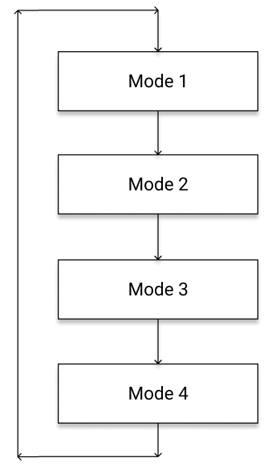
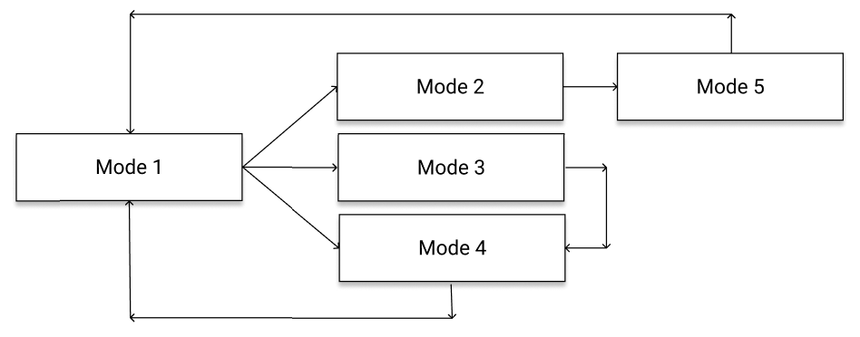

## Program state

Many of the programs we've written so far are *stateless* which means that the program acts only on its current input.

As the programs get more sophisticated they need to remember more *state*, allowing them to use past inputs to make decisions.

Some examples:

* Remembering a count of the number of times an event has happened.
* Keeping track of a mode (e.g. waiting for player, playing, showing score, etc).
* Tracking a position in a sequence (i.e. entering a specific button sequence).
* Remembering a high score.

### High scores

Often our program state is as simple as a single variable (e.g. a counter), for example the following program which counts the number of times a button has been pressed, and shows it when the other button is pressed.

```python
from microbit import *

count = 0
while True:
  if button_a.was_pressed():
    count += 1
  if button_b.was_pressed():
    display.show(count)
	count = 0
```

Another very common pattern is to keep track of a minimum or maximum (for example a high score). To calculate a highest score, the pattern would look something like:

```python
high_score = 0
while True:
  score = play_game()
  if score > high_score:
    high_score = score
```

For calculating a lowest score, we do the opposite. This program measures reaction time, and shows a star if you beat the previous time.

```python
from microbit import *
import random

# Our best time so far
best = 10000

while True:
  # Sleep for a random time between 1 and 2 seconds.
  sleep(1000 + random.randint(0, 1000))

  # Start the timer.
  display.show(Image.SQUARE)
  start = running_time()

  # Clear the button detection (in case they're already holding the button).
  button_a.was_pressed()

  # Wait for the next button press.
  while True:
    if button.a.was_pressed():
	  break

  # Stop the timer.
  finish = running_time()
  display.clear()

  # Check if this is the best time.
  t = finish - start
  if t < best:
    # Update the best time.
    best = t
    display.show(Image.HAPPY)
  else:
    display.show(Image.SAD)
  sleep(1000)

  # Reset.
  display.clear()
```

### Detecting sequences.

Sometimes it's useful to remember where we are in a sequence of events. For example, detecting a specific sequence of button presses, e.g. 'A' 'B' 'A' 'A' 'B'. In this case a good way to do it is to have a list of expected events, and keep track of how far we've made it through the list.

```python
LIST = [...]

def wait_for_sequence():
  for item in LIST:
    # check if the most recent event matches `item`
    if event != item:
      # Incorrect
      return False
  # We matched all events in sequence.
  return True
```

The next step is coming up with a way to detect the correct events:

```python
from microbit import *

# This function waits for a button press
# and returns true if it was the expected one.
def expect(btn):
  while True:
    if button_a.was_pressed():
      return btn == 'A'
    if button_b.was_pressed():
      return btn == 'B'

def wait_for_code(code):
  for c in code:
    if not expect(c):
      return False
  return True

while True:
  if wait_for_code('ABAAB'):
    display.show(Image.HAPPY)
  else:
    display.show(Image.SAD)
  sleep(1000)
  display.clear()
```

### Program modes

Some programs will need to operate in distinct modes at different times. When we move between these modes sequentially, this is fairly straightforward to implement:

```python
while True
  # Mode 1
  while True:
    # Do stuff for mode 1
    if finished:
      break

  # Mode 2
  while True:
    # Do stuff for mode 2
    if finished:
      break

  # ... etc
```



What if we need to be able to move between states? For example, mode 1 might be a menu system, and depending on which button we press, we need to move to one of modes 2, 3 or 4. Then mode 2 goes to mode 5, etc. At the moment, when a mode finishes, the inner loop `breaks` and it just goes onto the next mode. We need a way to signal which mode to go to next.



One way to do this is to have a mode (state) variable which any part of the code can set and will tell the code what to do next.

```python
mode = 1

while True
  if mode == 1:
    while True:
      # Do stuff for mode 1
      if something:
        mode = 2
        break
      elif something_else:
        mode = 3
        break
      elif something_else_again:
        mode = 4
        break

  elif mode == 2:
    while True:
      # Do stuff for mode 2
      if something:
        mode = 5
	break

  elif mode == 3:
    # ... etc
```

To make this code clearer, we can define some constants to name the modes.

```python
MODE_MENU = 1
MODE_WAITING_FOR_PLAYER = 2
MODE_PLAYING = 3
MODE_HIGH_SCORES = 4

mode = MODE_MENU

...
if mode == MODE_PLAYING:
  # etc
```

This is such a common pattern that it has a name -- a **state machine**. It's also common to extend this pattern to add code than runs for specific state transitions.

## Classes

We've seen how to use *functions* to organise our code into re-usable pieces of functionality. This can make our code easier to understand, and also less repeditive.

Classes (or *object oriented programming*) are way to group together functions with the data that they operate on. When a function is used in a class, we call it a *method*.

We've already used classes when we use the `microbit` module -- for example button_a is an instance of the MicroBitButton class. When we write

```python
if button_a.was_pressed():
  # do stuff
```

the `was_pressed` method belongs to the MicroBitButton class, and `button_a` is an *instance* of that class. Similarly `button_b` is a different instance of the same class.

In Python, we write classes using the `class` keyword, and put methods inside them. Methods take a special argument named `self` that refers to the instance that this method is being invoked on. i.e. in the example from before, when you write `button_a.was_pressed()` then the was_pressed method's `self` argument will be equal to `button_a`.

You can set *properties* on `self` -- this allows the class to store data for that particular instance.

Classes have a special method called `__init__` that is invoked when the object is created. Here's an example of how the `is_pressed` method could be implemented. *Note: MicroBitButton is actually provided by the MicroPython runtime, what we're showing here is just an example of what it would look like if it were written in Python. You could use something like this though if you were using an external button and you wanted to make it work like one of the two internal buttons.*

```python
class MicroBitButton:
  def __init__(self, pin):
    self.pin = pin

  def is_pressed(self):
    return self.pin.read_digital() == 0

# Somewhere inside the microbit module...
button_a = MicroBitButton(pin7)
button_b = MicroBitButton(pin13)
```

Here's a simple example of a class to represent a person:

```python
class Person:
  def __init__(self):
    self.name = 'No name'
    self.age = 0

  def set_age(self, age):
    self.age = age

  def set_name(self, name):
    self.name = name

  def say_hello(self):
    print('My name is "{}" and I am {}.'.format(self.name, self.age))

p = Person()
p.say_hello()
p.set_name('NCSS Student')
p.set_age(16)
p.say_hello()
```

Whenever you have multiple identical things plugged into the micro:bit you might want to write a class, and then create one instance for each one that is plugged in (similar to the button example above, where each instance knows which pin it's connected to).
