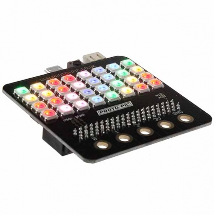
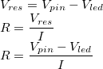
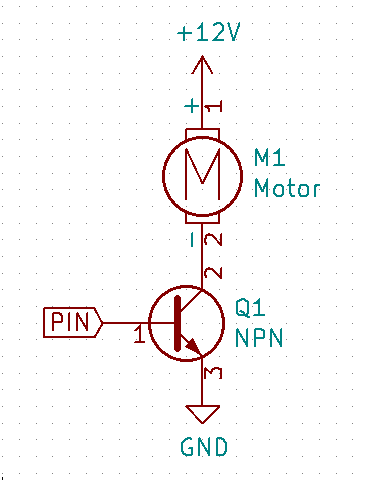
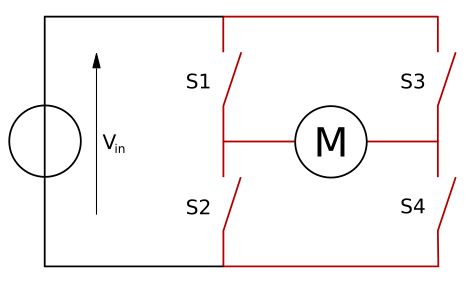

# Chapter 5 -- Grove

Grove is a name for plug and socket standard to attach in stuff (called modules) like sensors or buttons! It was developed by Seeed Studios -- they sell a range of different devices and modules that connect to each other using the Grove sockets.

They have 4 pins:

1. Signal (yellow)
2. Signal (white)
3. Power
4. Ground

The important thing to remember is **pin 3** is *always* power and **pin 4** is *always* ground. Many modules might only use pin 1. The pins used should be marked on the module. Here are the markings on the Grove Button:


Pin 1 is the `SIG`, so that is the pin that sends the button signal on. Pin 2 is `NC` which stands for *not connected*. `VCC` means *power*, and `GND` is *ground*. *These pins refer to the pin on the plug/socket. Once you plug it into a micro:bit, you'll need to figure out which micro:bit pin they're connected to.*

### Grove and micro:bit

For NCSS We have made micro:bit to Grove adapters which have 4 Grove connectors and a speaker.


The micro:bit pins that correspond to each connector, from right to left, are:

| Socket | Grove Pin 1 (yellow) | Grove Pin 2 (white) |
| --- | --- | --- |
| 1 (right) | pin0 | pin13 |
| 2 | pin1 | pin14 |
| 3 | pin2 | pin15 |
| 4 (left) | pin19 | pin20 |

`pin0` is also the speaker, but most adapters do not have a speaker attached. When using an adaptor with a speaker, don't use the first socket.

### Summary Table
| Sensor | Type | Description |
| --- | --- | --- |
| Buttons | Digital |Detects Presses |
| Buttons with LEDs| Digital | Detects Presses and also lights up |
| Tilt Switch | Digital | Detects when module is tilted beyond a certain point |
| Magnetic Switch | Digital | Detects presence of a magnetic field |
| Hall Effect Switch | Digital | Detects polarity of a magnetic field |
| Rotary Encoder | Digital | Turnable Knob in Discrete Steps |
| Joystick | Analog | X/Y potentiometer with Z-button |
| Continuous Rotation Servo | Digital PWM | Continuouly rotates at a given speed |
| Angle Servo | Digital PWM | Rotates to a given angle |
| Infrared Reflective Sensor | Digital | Senses proximity |
| PIR Motion Sensor | Digital | Detects movement |
| Sound Pressure Sensor | Analog | Detects loudness |
| Loudness Sensor | Analog | Detects loudness with adjustable gain |
| Multi Colour Flash LED | Digital | Flashes between colours |
| Circular LED | Digital | 24 LEDs in a ring |
| LED Bar | Digital | LED Bar chart |
| NeoPixels | Digital | RGB LED Strip |
| Level Shifter | Digital | Allows you to connect and power 5V Grove modules |
| Heart rate monitor | Digital | Attaches to a finger to measure heart rate |

### Grove Components

A non-exhaustive list of Grove components that we have available, as well as a short description of each is given below.

#### Reflective Infrared Sensor
This is a proximity and colour sensor. It can detect the presence of close by objects and distinguish between light and dark colored objects. Meaning you could get the robot to avoid crashes by detecting the walls first!


#### PIR Motion Sensor (Passive Infrared Sensor)
Movement from humans, animals and other moving objects can be detected using the PIR motion sensor.


#### Multicolour Flash LED (Party LED)
Just like a disco! Like a "party LED", it quickly flashes between bright colours.


#### LED Buttons (Red, Yellow, Blue)


#### Button


#### Circular LED


#### Hall Effect Sensor (magnet sensor)

Used to measure the magnitude of a magnetic field.


#### Magnetic Switch

Good for measuring proximity. The magnetic switch turns on when a magnetic field is detected nearby.


#### Loudness and Sound Sensor
The loudness and sound sensors are very similar, in that they both contain microphones, and both detect loudness (as opposed to being true microphones), have an analogue output and recognize the presence of sound. However, while the Grove sound sensor has a fixed gain, the loudness sensor has an adjustable gain. In addition to this, the filtering on the loudness sensor has a lower cutoff, so it will respond to changes in loudness slower.


#### Positional Encoder
Whenever you need a rotating knob, for example as a volume changer, then the encoder is for you! It encodes the rotational movement and outputs it as an electronic pulse.


#### Tilt Switch
Tilting the switch different directions causes the sensor to give output as either True or False.


#### Thumb Joystick


#### Servos

It's where you go to get your petrol mate!

Connecting other components to servos allows them to be moved and rotated


#### NeoPixels

A strip of multi-coloured LEDs where each LED can be controlled individually. Needs the level shifter. The strips can be cut to size.


#### Heart Rate Monitor


### Other non-Grove Components:

We also have some other components that you can use in the labs and in your project. Some of them will require a breadboard to connect to, otherwise you can ask a tutor to solder some Grove cables onto them.

#### RGB LEDs


Datasheet here: [](https://cdn.sparkfun.com/datasheets/Components/General/YSL-R1047CR4G3BW-F8.pdf)

#### Potentiometer

This is a variable resistor that changes based on the angle you turn it to (like a volume knob).

#### LDR (Light Dependant Resistor)

This is a device that changes it's resistance based on how much light is shining on the sensor.


#### Flex Sensor

This is a variable resistor that changes based on how much the strip has been bent.


#### GPS Receiver

Allows you to receive latitude/longitude/time.

#### micro:pixel Edge

Adds 10 Neopixels to the edge of your micro:bit.


#### micro:pixel

Adds a 4x8 grid of Neopixels to the micro:bit.



#### Ultrasonic Distance Sensor

Measures how far away an object is using ultrasound (SONAR). These are much easier to use from the bit:bot as the necessary circuitry is provided by the bit:bot.

## Pulse Width Modulation

We've seen how to control an LED connected to a pin by using `write_digital` to turn the pin on or off. Once we choose a value for the current limiting resistor however, the brightness is fixed.

The most obvious way to make the brightness change would be to change the pin voltage, as you can see in the formula:



If the pin voltage decreases, then the current will decrease correspondingly, which will lower the brightness of the LED. Unfortunately, most microcontrollers do not have a way to set a pin voltage to anything other than *digital low* (0V) and *digital high* (often 3.3V or 5V), whereas we'd need some way to set an *analog voltage*. Some microcontrollers may have a device called a "Digital to Analog Converter" (DAC), but typically this will only be connected to one or two pins, and the micro:bit does not have one.

Instead, we use a different technique. If we turn the LED on and off very quickly, then our eye will perceive this as reduced brightness. This also works well for controlling the speed of devices like motors.

So if we had an LED connected to pin0, with a current limiting resistor chosen such that the LED is at full brightness when the pin is turned on, then the following code will make the LED show at half brightness.

```python
from microbit import *
while True:
  pin0.write_digital(1)
  pin0.write_digital(0)
```

Because this loop has no sleeps or delays in it, our eyes will not be able to see the LED flickering as it turns on and off. On the micro:bit, changing a pin from Python takes about 1 ms (millisecond), so the LED is flashing at about 500 Hz.

By adjusting the amount of time it spends on vs off, we can set the brightness to anything we like. The following code will turn on the LED for 1/4 of the total time.

```python
from microbit import *
ON = 1
OFF = 3
while True:
  for i in range(ON):
    pin0.write_digital(1)
  for i in range(OFF):
    pin0.write_digital(0)
```

*Note: there are no sleeps needed in this code for the write_digital calls do something. We rely on the fact that `write_digital` itself takes about 1 ms to execute.*


This is called "Pulse Width Modulation" or PWM. Our code is generating pulses, and modulating their width. (Modulation is one thing controlling another thing). Some terminology:

* The **pulse length** is how long the pin is on for. In the first example, it's approximately 1 ms.
* The **period** is the length of time from the start of one pulse to the next. In the first example, this is approximately 2 ms, in the second it is `ON + OFF` ms.
* The **frequency** is how many pulses per second. It is calculated as `1 / period`, so in the first example, `1 / 0.002 = 500 Hz`.
* The **duty cycle** is the ratio of the pulse length to the period, expressed as a percentage. So the first example is 50%, the second example is 25%. The duty cycle will correspond to the brightness (or the motor speed, etc).

### Built-in PWM Support

The micro:bit can do this for you using the `write_analog` method. This method takes the duty cycle, but expressed as a number between 0 (i.e. 0%) and 1023 (i.e. 100%). *Can you guess why 1023 is the maximum? Ask your tutor!*

So the two examples from above would simply become:

```python
from microbit import *
pin0.write_analog(512)
```

```python
from microbit import *
pin0.write_analog(256)
```

This has two big advantages over toggling the pins manually:

* It runs automatically in the background, allowing your code to do other things.
* The timing is more precise and can run at a higher speed.

The default period is 20 ms (50 Hz), however this can be adjusted using `set_analog_period` or `set_analog_period_microseconds`.

## Servo Motors

Last chapter we looked at Pulse Width Modulation (PWM). It's very useful for making an approximation of an analog output from a digital system (such as LED brightness or motor speed control). Another really common usage of PWM is for *servo motors*.

First, some background about motors:

### Regular Motors

A motor is a device that uses an electromagnet to rotate when a voltage is applied. They come in two main variants:
 * Direct current (DC). A constant voltage is applied to the terminals, and the motor will spin continuously at a speed determined by the voltage (and PWM).
 * Alternating current (AC). A sinusoidal voltage (or voltages for multi-phase motors) is applied to the terminals and the motor's frequency is related to the frequency of the waveform. This is commonly used for large motors, especially powered by mains power (which is already AC). You can also generate the AC waveform using an *inverter*.

A motor's speed is determined by the voltage, and the torque by the amount of current, that the motor is able to draw from the power supply. *As a microcontroller can typically only supply a very small amount of current, you cannot drive a regular motor directly from a microcontroller pin.* It's also common to drive a motor with a different voltage from the microcontroller.

To drive a motor from a microcontroller, you need a circuit that can switch on or off the motors power supply based on input from the microcontroller. This can be done with a transistor, which acts as an *amplifier* -- allowing a small current & voltage from the microcontroller to control a large current & voltage in the motor.



In order to make the motor spin in both directions, you need four transistors, in an arrangement called an H-bridge. In the diagram below, the transistors are shown as switches, but you can see that turning on S1 and S4 will cause current to flow through the motor in one direction (forwards spin), and turning on S2 and S3 will cause it to flow in the opposite direction (reverse spin).



### Continuous Rotation Servo Motors

This is a type of servo motor that packages an H-bridge and a gearbox into a self-contained unit. The PWM input is used to set the motors speed and direction.

### Standard Servos (angle)

This is the more common type of servo, where the PWM input is used to set the motor's angle. They work by automatically turning the motor forwards or backwards until the angle reaches the desired angle.

The way they work internally is they contain a *potentiometer*, connected to the output. This is a device that changes resistance depending on how far it has been rotated. The servo contains a small circuit that measures the resistance of the potentiometer, and turns on the motor until it sees the resistance increase or decrease to match the desired angle.

The logic inside a servo motor is roughly equivalent to the following code:

```python
while True:
  current_angle = get_angle_from_potentiometer()
  desired_angle = get_angle_from_pwm_input()
  if current_angle < desired_angle:
    set_motor_speed(1)  # Turn right.
  elif current_angle > desired_angle:
    set_motor_speed(-1) # Turn left.
  else:
    set_motor_speed(0)
```

### Controlling a servo motor

Servo motors three connectors:
* Power
* Ground
* Signal (PWM)

Servo motors are designed to take a PWM signal, and typically they care only about the pulse length. Importantly, their internal motor is powered by the power pin, and only controlled by the signal from the microcontroller.

#### Continuous rotation

* 0.6ms full speed reverse
* 1.05ms half speed reverse
* 1.5ms stopped
* 1.95ms half speed forward
* 2.4ms full speed forward

The following example sets the motor speed and direction based on a value from `-1` to `1`.

```python
def set_speed(pin, speed):
  pin.set_analog_period(20)
  pulse_length_ms = 1.5 + 0.9 * speed
  duty_cycle = pulse_length_ms / 20
  pin.write_analog(round(1023 * duty_cycle))
```

#### Standard

* 0.6ms -90&deg;
* 1.05ms -45&deg;
* 1.5ms 0&deg;
* 1.95ms 45&deg;
* 2.4ms 90&deg;

The following example sets the servo angle base on a value from `-90` to `90`.

```python
def set_angle(pin, angle):
  pin.set_analog_period(20)
  pulse_length_ms = 1.5 + 0.9 * angle / 90
  duty_cycle = pulse_length_ms / 20
  pin.write_analog(round(1023 * duty_cycle))
```

### Extra: Stepper motors

Servo motors have two limitations:

* Their angle is not very precise due to the potentiometer and the difficulty in reading the PWM pulse length. It's typically fine for steering a remote controlled car, but not for controlling the head of a laser cutter or an industrial robot.
* They only operate over a fixed range (typically 180 degrees), because potentiometers have a fixed range of movement.

There exist types of servo motors that avoid both of these problem by using different types of sensors to measure the angle (for example by detecting a magnetic field from a magnet attached to the shaft, or measuring the angle optically using a rotating disc). The ClearPath motors from Teknic are a good example.

Another option is to use a *stepper motor* which is a type of AC motor, where by generating specific waveforms you can make the motor precisely turn in discrete movements over a very small angle. These typically need a *stepper motor driver* circuit to operate.
