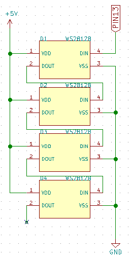
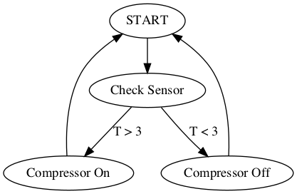
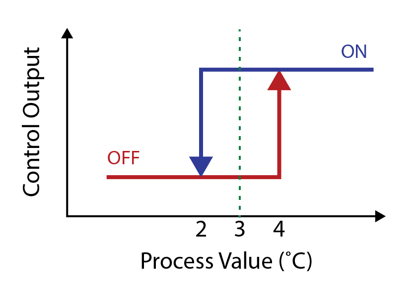
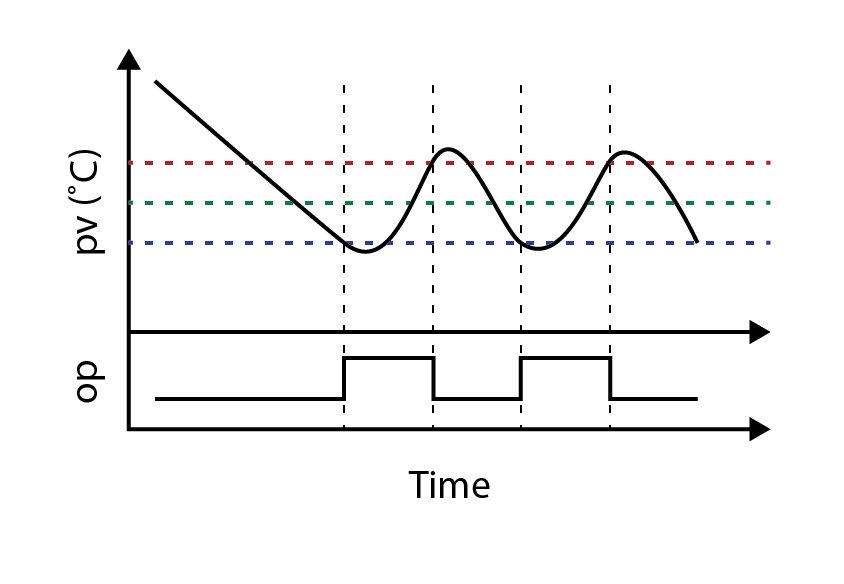
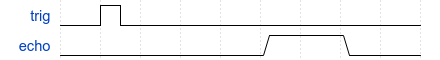

## Chapter 7 -- Robotics with the micro:Bit

Aside from working with sensors and screens, we can also hook up our micro:bits to various types of robot. For our labs we are going to be working with the bit:bot. The bit:bot is a robot designed specifically for the micro:bit, and interfaces with the micro:bit via the edge connector. It has the following features:

* Line following sensors that detect the lightness of the surface that the bit:bot is driving on
* Light sensors that allow it to detect the ambient light on either side
* Two geared motors, allowing differential steering
* A buzzer (which makes a buzz noise)
* 12 programmable RGB LEDs
* Optional accessories, including a distance sensor and a claw

<span style="color:red">**Warning!!**</span> The gearboxes on the bit:bot are a little fragile, and the teeth on the gears can break if too much torque is applied. Don't try to hold the wheels from spinning while the motors are on.

We'll start with exploring the features of the bit:bots, then learning about some algorithms for making the bit:bots perform various line following tasks.

### Getting Started

The bit:bots are controlled using a micro:bit via the edge connector. Unfortunately, when we have the front attachment installed the micro:bit does not fit into the robot, and the screen is partially obscured. For this reason, most of the time we would want to use the "angle:bit" connector that allows the micro:bit to stand vertically.

Each function on the bit:bot is accessible on a pin through the micro:bit. The below table lists the various functions that you can access:

| Function | Pin | Description |
| --- | --- | --- |
| Left Motor Direction | Pin 8 | Access using `write_digital`<br>`0 - Forward`<br>`1 - Backwards` |
| Left Motor Speed | Pin 0 | Speed `0 - 1023` with `write_analog` |
| Right Motor Direction | Pin 12 | Access using `write_digital`<br>`0 - Forward`<br>`1 - Backwards` |
| Right Motor Speed | Pin 0 | Speed `0 - 1023` with `write_analog` |
| Left Line Sensor | Pin 11 | Access using `read_digital`<br>`HIGH` on a reflective surface<br>`LOW` on a dark surface |
| Right Line Sensor | Pin 5 | Access using `read_digital`<br>`HIGH` on a reflective surface<br>`LOW` on a dark surface |
| Neopixels | Pin 13 | RGB LEDs around the edge of the bit:bot.<br>Access using the `neopixel` module |
| Buzzer | Pin 14 | Makes a beeping noise, when accessed using `write_digital` |
| Light Sensor Select | Pin 16 | Select upwards facing light sensor to read.<br>`LOW` - Left Sensor<br>`HIGH` - Right Sensor |
| Light Sensor Input | Pin 2 | Reads the upwards facing light sensors on the left/right of the micro:bit.<br>Returns a value between `0-1023` |

If you ever need it, this information is also helpfully printed on the bottom of the bit:bots.

**NOTE** The light sensors are not useful for line following, for that task you must use the line sensors, which return a digital value.

#### Powering the bit:bot

In order to use any of the functionality on the bit:bot, the bit:bot needs to be switched on using the switch at the back of the robot. The bit:bots are powered via three AA batteries which can also be used to power the micro:bit. Confusingly, if the micro:bit is plugged into the PC via the USB cable, the micro:bit will operate, however none of the bit:bot peripherals will be operational, including the motors, light and line sensors.

### Programming

#### Driving
There are four pins that control driving:

* pin8 -- left direction
* pin12 -- right direction
* pin0 -- left speed
* pin1 -- right speed

The direction pins can be set to `LOW` (forward) or `HIGH` (backward), by using `pin8/12.write_digital(0)` or `pin8/12.write_digital(1)` respectively.

The speed pins can be set using PWM (pulse width modulation) by using `pin0/1.write_analog(speed)` where `speed` is a number between `0` and `1023`. To recap, PWM will turn the pin on for a fraction of the time, which has the effect of reducing the speed of the motor (just like how we used it to change the brightness of an LED).

Confusingly the speeds moving in the **reverse** direction are reversed, so to run at quarter speed in the forward direction, we would write speed `256` and to move at quarter speed in the reverse direction, we would write `1024 - 256 = 768`.

For example, to drive the bit:bot forward at 1/4 speed:

```python
pin8.write_digital(0)
pin12.write_digital(0)
pin0.write_analog(256)
pin1.write_analog(256)
```

Or to drive the bit:bot in an arc to the left:

```python
pin8.write_digital(0)
pin12.write_digital(0)
pin0.write_analog(256)
pin1.write_analog(512)
```

To move backwards:
```python
pin8.write_digital(0)
pin12.write_digital(1)
pin0.write_analog(256)
pin1.write_analog(768)
```

To spin on the spot, you can drive the motors in opposite directions:

```python
pin8.write_digital(0)
pin12.write_digital(1)
pin0.write_analog(512)
pin1.write_analog(512)
```

#### Line sensing

The line sensors are connected to `pin11` and `pin5`. They will read `HIGH` or `LOW` depending on whether the surface below them is light or dark respectively. The sensors themselves are the pair of black/blue bumps situated just behind the front coaster on the bottom of the bit:bot. They are made up of an infrared (IR)-LED (the bluish bulb at the front of each sensor) and a photodiode with an IR filter (black bulb at the back of each sensor). Although the IR light is not visible to the naked eye, most mobile phone cameras do not completely block IR light, so if you are curious you can see a purplish-glow from those LEDs.

On a reflective or white surface the light from the LED at the front is reflected back at the photodiode, causing the sensor to read `HIGH`. On a dark or absorbing surface, the sensor will read `LOW`.

For these sensors, the thresholds are fixed and unchangeable, which has led to issues when using the sensors on shiny surfaces, such as tiles. If you would like to use the sensors on tiled surfaces, we recommend either printing a dark line onto white paper, or pulling over a carpet.

For example here is a simple example that stops the bit:bot if it drives from a dark surface onto a light surface.

```python
# Drive forward slowly.
pin8.write_digital(0)
pin12.write_digital(0)
pin0.write_analog(256)
pin1.write_analog(256)

while True:
  left_sensor = pin11.read_digital()
  right_sensor = pin5.read_digital()

  if left_sensor or right_sensor:
    # Detected dark on either sensor, stop the bit:bot.
    pin0.write_analog(0)
    pin1.write_analog(0)
  break
```

During the labs we will usually be following a line made of masking tape against the black carpet. As a result, the sensors will read `HIGH` when the sensors run over the tape.

#### Light sensing

The light sensors on top of the bit:bots, unlike the line sensors, are analog sensors, and so are able to detect a range of different light values. Unfortunately, as there are only 3 free analog pins on the micro:bit, and 2 of those are used to control the motors, we somehow have to multiplex two light sensors onto one analog pins. In order to do this, the bit:bot uses `pin16` to control a switch that selects which sensor should be read, and the sensor value can be read from `pin2`.

For example, to read the left and right sensor values, we can do:

```python
# Select the left sensor
pin16.write_digital(0)
left_sensor = pin2.read_analog()

# Select the right sensor
pin16.write_digital(1)
right_sensor = pin2.read_analog()
```

#### Neopixels

Along the edge of the bit:bots there are 12 RGB LEDs called neopixels. By writing values RGB values to each of these sensors, we can show colors around the edge of the LEDs. The neopixels are chained together on a single pin, such that we don't need to use a pin (or 3) per LED. We will go neopixels in more detail in the next chapter, but as an example of how they work, let's set the 2nd LED to show a dim blue light, and the 8th LED to show a bright green light:

```python
import neopixel

neopixel_pin = pin13 # Control pin for neopixels
neopixel_num = 12 # The number of neopixels in the chain

np = neopixel.NeoPixel(neopixel_pin, neopixel_num)
np[2] = (0, 0, 40) # Format is (r, g, b) with a number between 0-255 for each
np[8] = (80, 0, 0)
np.show()
```

#### Buzzer

The buzzer on the bit:bot have an internal oscillator, and put out a fixed tone when pin 14 is driven `HIGH`. Note that this also means that we are only able to play a single tone with this speaker.

```python
# Play a short beep.
pin14.write_digital(1)
sleep(500)
pin14.write_digital(0)
```
## Neopixels & programmable LEDs

As well as the line following and light sensors, the bit:bots also have 12 programmable RGB LEDs. These are commonly known as "Neopixels", however their real part name is `WS2812B`.

On the bit:bot, the 12 LEDs are arranged in two strips of 6, connected to pin 13. You can also buy them in pre-made flexible strips.

### Programmable LEDs
We've seen how to control an LED and change its brightness using PWM on the micro:bit. To recap, we connect the LED to the pin, use a current limiting resistor to set the maximum brightness, then use PWM to control how much time the LED spends turned on (which is effectively the brightness).

A regular RGB LED is just a red, green, and blue LED inside the same bulb, so we use the same method to control the brightness of each of the three primary colours, which lets us create any colour combination we like.

The problem is that this takes a lot of pins on our micro:bit, and needs a lot of resistors. Imagine trying to do this for more than 10, let alone hundreds or thousands of LEDs.

Programmable LEDs, on the other hand, have tiny integrated circuits inside of them, and we can send digital messages to them to set the colour and brightness. They also chain together, so by having our micro:bit connected to just the first one, they will send the messages along the chain to control all of them.

Here's an example of four WS2812Bs wired together (this is adapted from the Quokka circuit diagram -- you'll see the Quokka later in the week).



### Programming

```python
import neopixel
leds = neopixel.Neopixel(pin13, 12)

for i in range(12):
  leds[i] = (128, 0, 0,)
leds.show()
```

This uses the built-in `neopixel` module that is included with micro:bit MicroPython. The code constructs an instance of the Neopixel class, telling it how many LEDs we have in the chain (`12`), and which pin the first one is connected to (`pin14`). You can check the pin number by looking at the notes on the bottom of the bit:bot.

This gives us an object, `leds`, which behaves like a list of tuples of `(red, green, blue)`. We can set the colour and brightness of any LED by assigning to that element of the list. So `leds[3] = (0, 255, 0,)` would set the fourth LED to green at full brightness. In the example above, we set all 12 LEDs to red at half brightness.

Whenever you change any LEDs, you need to call the `show` method to send the new information to the LEDs. You can also use the `clear` method which will set all the LEDs to `(0, 0, 0,)` and call `show` for you.

### Colour mixing

Here are some example colours:

```python
COLOUR_BLACK = (0, 0, 0,)
COLOUR_WHITE = (255, 255, 255,)
COLOUR_RED = (255, 0, 0,)
COLOUR_GREEN = (0, 255, 0,)
COLOUR_BLUE = (0, 0, 255,)
COLOUR_PINK = (255, 0, 255,)
COLOUR_YELLOW = (255, 255, 0,)
COLOUR_CYAN = (0, 255, 255,)
COLOUR_ORANGE = (255, 128, 0,)
COLOUR_PURPLE = (204, 0, 255,)
```

### Extra: Other types of programmable LED

The main alternative to the WS2812B is the APA102C (commonly known as "Dotstars"). These have two distinct advantages over the WS2812B:
 * They are much easier to program, as they use SPI communications.
 * They have a much higher refresh rate, allowing for video and persistence-of-vision effects.

At NCSS we use WS2812B because of the built-in `neopixel` module, but it's also possible to use APA102Cs via SPI. Like the WS2812B, they also run at 5 volts, so will require a level shifter to use from the micro:bit and pyboard/Quokka.

```python
from microbit import *

spi.init(mosi=pin0, sclk=pin13, baudrate=1000000, mode=1)
data = bytearray([0]*4) + bytearray(NUM_LEDS * 4) + bytearray([0xff]*4)

def show():
  spi.send(data)

def set_colour(n, r, g, b):
  data[n * 4 + 4] = 0b11100100
  data[n * 4 + 5] = b
  data[n * 4 + 6] = g
  data[n * 4 + 7] = r
```

There are also variations of the WS2812B and APA102C that add things like a fourth "colour" which is an extra white LED.

## Line following

We've already seen how we can use the sensors on the bottom of the bit:bot to detect masking tape. In Python, we read the current state of these sensors with `pin11` and `pin5`. We can make a very simple line following program by reading whether the sensors are over the masking tape and applying a correcting rotation when they are:

```python

while True:
  if pin11.read_digital() == 1:
    # left side on masking tape, turn left.
  if pin5.read_digital() == 1:
    # right side on masking tape, turn right.
  else:
    # all clear, drive straight.
```

### Theory of Control

The code above is an example of a "control" algorithm -- it continuously adjusts an output (e.g. the motors) in order to maintain a desired state (following the line), and optionally reads some sensor or sensors (the light sensors) in order to measure the output. You see control algorithms everywhere - here are some examples:

 * An automatic light switch turns off the light after it's been on for 10 minutes.
 * An automatic light that detects motion to keep the light on while people are in the room.
 * An air conditioner monitors the current room temperature and turns on or off the compressor, heater and fans. (Or similarly, a fridge).
 * The cruise control system in a car monitors the speed, and adjusts the accelerator to maintain a constant speed.

There are two main categories of control algorithms, "open-loop" and "closed-loop" control. The difference being whether they use feedback from sensors to change their behaviour.

Since these algorithms are very commonly used to control systems, there are a couple of bits of jargon that you may come across when reading about control algorithms. The three most important terms that you will come across repeatedly are:
* Process value (pv) -- the current measured value (e.g. in degrees C)
* Set point (sp) -- the desired state (i.e. the desired temperature in degrees C)
* Output (op) -- the current control output (i.e. is the compressor on or off)

#### Open-loop control

Like the first automatic light example above, no feedback from sensors is used, so the control loop is said to be "open". Instead some model of how the system operates is used to "guess" what will happen (in this case the simple model is that people leave the room within 10 minutes).

Here are some examples from the bit:bot:
* Drive forward 1 metre by turning on both motors at full speed for 3.7 seconds.
* Turn left 90 degrees by turning the the motors in opposite directions for 0.9 seconds.
* Follow a course by pre-programming motor movements.

You might recognize this form of control from the previous lab. When we preprogrammed the motor powers and rotation times to get our robot to move in certain ways in the previous lab we were doing *open loop control*.

Open-loop control is much simpler to implement, but tends to make it very difficult to get accurate results. For example, if the battery is lower, then the time needed to drive forward 1 metre will be longer. If the torque of the two motors is different (due to imperfections in the gears, fluff on the tyres etc.) then we have to adjust the powers in our program with no guarantee they won't change. *For this reason it's very difficult to do line following with open loop control!*

#### Closed-loop control

The system operates in a loop, where sensor readings provide "feedback" into the control algorithm. The fridge or air conditioner is a great example of this -- when the temperature is too high, it turns on the cooling, and when it's too low it turns it off.



Here are some examples from the bit:bot:
* Drive forward 1 metre by using the ultrasonic distance sensor to measure how far has been travelled.
* Turn left 90 degrees using the micro:bit's compass.
* Line following using the line sensors on the bit:bot.

The main challenge with closed-loop control is getting good results from the sensors, and figuring out how to translate the sensor inputs (`pv`) into control outputs (`op`).

### Control Algorithms

Although it does add an additional bit of complexity, for any system that needs to operate for any length of time, some form of closed-loop control is generally necessary. The difficulty then becomes how does one translate a control input

#### "Bang bang" control

You've probably heard your fridge loudly "click" as the compressor turns on or off. This is an example of "bang bang control", named because it switches abruptly between two states.

A very basic implementation might look something like this:

```python
sp = 3
while True:
  pv = fridge.temperature()
  if pv < sp:
    compressor.off()
  else:
    compressor.on()
```

The problem with this simple approach is that the compressor will *oscillate* very quickly between on and off as the fridge hovers around 3 degrees C. This will be particularly bad if the temperature sensor is noisy.

To improve this, we have two options. The first is to simply slow down our loop, preventing the system from changing state too often. In this case, adding a `sleep(30 * 60 * 1000)` at the end of the loop to only allow the compressor to be adjusted every 30 minutes. This will result in our algorithm being less responsive to temperature changes in the fridge, but will at least prevent this oscillation.

The other option is to turn the compressor on at a higher temperature, and off at a lower temperature. This is called adding `hysteresis` to the system. In the example below, we still target 3 degrees C, but allow a movement down to 2 and up to 4 before changing the compressor state. In this case the state of the compressor (output) will change depending on the temperature (process value) something like this:


```python
sp = 3
while True:
  pv = fridge.temperature()
  if pv < sp - 1:
    compressor.off()
  elif pv > sp + 1:
    compressor.on()
  # Otherwise compressor stays in the same state.
  sleep(60 * 1000)
```

The temperature of the fridge using this sort of control will then look something like:


The simplest possible line following algorithm works in much the same way, however there's a key difference. In a fridge, we can measure the PV (current temperature) extremely well, but only have very crude control over the OP (compressor on/off). On a bit:bot we have very good control over the OP (motor speed), but a very limited way to measure the PV (are we currently over a line).

#### Proportional control

To continue with the fridge example, wouldn't it be great if we could instead adjust the power to the compressor to match the temperature difference. In fact, modern fridges have a VFD (variable frequency drive) compressor that allows it to run at different power levels, instead of just on or off.

When a control algorithm drives the output as a function of the difference between the PV and SP, this is called *proportional control*. This is the first part of a commonly used control algorithm called a PID Controller. PID stands for *proportional-integral-derivative*.

#### Line following

For our line following algorithm, the obvious approach is to use the following values:
 * sp - make both sensors read "dark".
 * op - motor speeds.
 * pv - current sensor readings ("light" or "dark").

Try experimenting with the bang bang controller above in order to make your bit:bot follow a track. Notice how the bit:bot will tend to bounce on and off the line, and have some difficulty following corners. Try adjusting the `sleep` in the loop to see how that impacts the bit:bot's ability to follow the line.

One of the main ways to improve this is to look at how to get a better indication of how far onto the line the sensor is. By recording how many times we see the line, we can get a crude approximation of this. The assumption here is that once the bit:bot drives onto the line, driving forward is likely to keep it on the line. This is a reasonable assumption, especially over short time periods.

```python
count_left = 0
count_right = 0
while True:
  if pinA.read_digital() == 1:
    count_left += 1
  else:
    count_left = max(0, count_left - 1)
  if pinB.read_digital() == 1:
    count_right += 1
  else:
    count_left = max(0, count_right - 1)

  if count_left > 4:
    # turn left
  elif count_right > 4:
    # turn right
  else:
    # drive straight

  sleep(500)
```

The example above is using the number of times we've detected the line as an approximation of how far we've driven onto the line. Like the fridge example above where we used a range of values, this means that the bit:bot will be less sensitive and allow for smoother movement and less oscillation.

*Note: this is very similar to the "I" (integral) part of a PID controller.*

## Ultrasonic distance sensing

The bit:bots include an ultrasonic distance sensor which connects to the header at the front. *Note: make sure you use the angle:bit to connect your micro:bit so that the USB cable does not get in the way.*

These ultrasonic sensors work by measuring the echo time ("time of flight") of an ultrasonic sound pulse. Sound travels at approximately 340 metres/second, or in other words, 1 centimeter every 29.4 microseconds. That's too fast to measure with a stopwatch, but no trouble at all for a microcontroller.

*This is how you can measure approximately how far away lightning is by measuring the time between the flash and the boom and multiplying by 1000/340 (which is ~3).*

The sensors on the bit:bot are called *HC-SR04*. You can read more about them in [the HC-SR04 datasheet](https://cdn.sparkfun.com/datasheets/Sensors/Proximity/HCSR04.pdf).

These sensors have four pins:
 * Power (5V)
 * Ground
 * Trig
 * Echo

*Note: although the distance sensors require 5V, the bit:bot takes care of this for us. If you were connecting an ultrasonic sensor directly to the micro:bit, you'd need additional circuitry.*



To measure distance, you send a brief pulse on the trig line, then measure how long the pulse on the echo line lasts for. Because we want the timing to be accurate, we used a special built-in MicroPython function to time the pulse for us named `machine.time_pulse_us`. This function takes a pin and a pulse level. In this case we're looking for a "high" pulse, so we set the level to `1`.

To calculate the distance, we multiply the length of the pulse by the speed of sound, divided by two.


Because the pulse is measured in microseconds, and we want the distance in centimeters, we use 0.034 centimeters/microsecond as the speed of sound. The divide by two is required because it's the time taken for the ultrasound to travel to the target and echo back again.

Confusingly, on the bit:bot, the `echo` and `trig` lines are connected together into a single micro:bit pin (pin 15), so you need to first send the trigger, then switch the pin back to input, then time the pulse.

```python
from microbit import *
import machine

def distance_cm():
  # Send a pulse on pin 15
  pin15.write_digital(1)
  pin15.write_digital(0)
  # Read from the pin to turn it back to an input.
  pin15.read_digital()
  pulse_time = machine.time_pulse_us(pin15, 0, 1)
  if pulse_time < 0:
    return 0
  return pulse_time * 0.034 / 2

while True:
  print(distance_cm())
  sleep(500)
```
