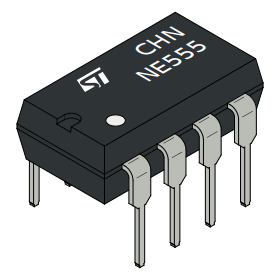
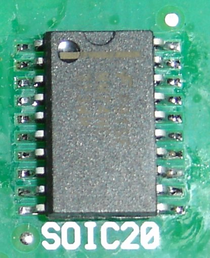
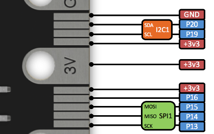
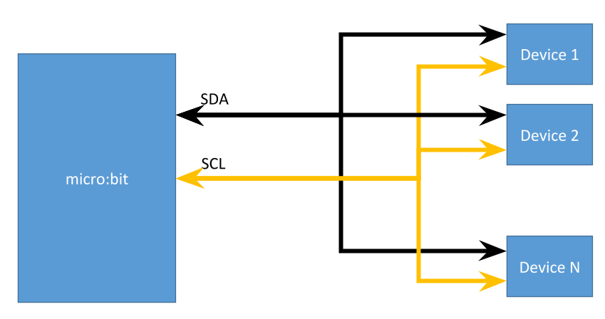

# Integrated circuits

Integrated circuits (ICs), are chips that perform a specific function in electronics.

So an IC is also a circuit made of wires, transistors, and other components, that are designed to make your life easier and do lots of the complicated electronics functions for you!

There are two general types of packages that ICs come in *surface mount* and *through-hole*. As the name would suggest, surface mount are designed to be soldered to the surface of a PCB, so no wiring needs to go

ICs come in [*lots of different types*](https://en.wikipedia.org/wiki/List_of_integrated_circuit_packaging_types), but here are some ones you might see at NCSS:

| Package | Picture |
| --- | --- |
| DIP |  |
| TO-220 |  |
| SOIC |  |
| SOT |  |

The type of package may not make a big difference in performance, but it will make a big difference in terms of fitting the device onto your circuit board, and how the device is wired up on a PCB.

If you're ordering ICs, they will come in a variety of packages with slightly different part-numbers that reflect the change, it's really easy to buy the write chip but the wrong package in a PCB you've designed, so it's important to be careful and check the datasheet.

All of our chips at NCSS will be DIP (which stands for dual in-line package), so they can be used in breadboards, but take a look at the circular LEDs or the LED bar, and see if you can identify what the package is!

### Pin numbers

If you look closely on a package, there will be a dot in the top-left corner. That's where `pin1` is. To get all the pin numbers, count upwards counter-clockwise like this:


### Datasheets

You can find out what pin does what by looking at the datasheet, which is the technical document that contains all of the information about the IC we are using.

This includes information such as:
- Pinouts (which means what pin does what)
- Example circuits
- Electrical characteristics
- Package information

**Datasheets are critical**, since they are the only way for us to find out all the information about a device that we are using.

## Digital signalling

With microcontollers, it's very common to want to transmit more information that just a voltage level to a sensor or peripheral device. It is possible to use many wires with different analog voltages to transmit more information, but to minimise the number of wires needed, we use digital signalling protocols to achieve this instead.

To send a digital signal there is only a certain number of things we can do:
- Set a voltage on a wire
- Read a voltage from a wire

We could use a simple solution sending a `0` or `1`, but how can we tell when a message starts and ends? Or tell the if there are two `0`s in a row?

The answer is we need to come up with an agreed method to do this, and there are a couple of common methods in use:
- UART
- SPI (Serial peripheral interface)
- I2C (inter-integrated circut)

### UART

UART stands for Universal Asyncronous Receiver/Transmitter, **asyncronous** means that communication happen without the use of an external clock. So each direction of transmission occurs on 1-wire from 1 device to another. To transmit and receive requires each direction to be on it's own wire.

The signal looks like this:


Let's take a look at exactly what happens, the entire sequence of bits sent to send one byte is called a *frame*:
1. The wire is held `HIGH`
2. It is then pulled `LOW`, this is the **start bit**
3. At a regular time interval, the next bits in the byte are read
4. There is an optional `parity` bit at the end, which is used for error-checking
5. The line is pulled high, this is the **stop bit**
6. The line stays high until the next frame.  

For this to work, a few things need to be agreed by both devices before communication occurs:
- Data rate (also called baudrate), the micro:bit defaults to `115200`
- If a parity bit is sent, and whether that is `even` or `odd`
- Number of stop bits

You might use this to communicate to the computer to the micro:bit. **Warning**: because the micro:bit only has one UART, you will lose the serial console if you do this, so it's difficult to debug.

The [micro:bit documentation](https://microbit-micropython.readthedocs.io/en/latest/uart.html#microbit.uart.init) lists the default values:

```python
uart.init(baudrate=9600, bits=8, parity=None, stop=1, *, tx=None, rx=None)
```

So to connect to a device with `tx` on `pin0` and `rx` on `pin1` at a baudrate of `9600`:

```python
uart.init(9600, tx=pin0, rx=pin1)
```
will achieve this.

To get back the serial console, use the line:
```python
uart.init(115200)
```

Here's a working example to receive information on the `uart`:
```
from microbit import *

uart.init(9600, tx=pin0, rx=pin1)

while not uart.any():
  pass

sleep(500)
data_in = uart.readall()

uart.init(115200)
print(data_in)
```
What this code does, is once there is data on the `uart`, `sleep` for a short time and read all the data, re-initialise the serial console and `print` the data read in back to the console.

Please [read the documentation](https://microbit-micropython.readthedocs.io/en/latest/uart.html) for examples of the other functions.

### SPI

SPI stands for Serial Peripheral Interface, and is **syncronous** communication which means it has an external clock signal.

It's used because it's one of the fastest methods of chip-to-chip communication without using lots of parallel wires, because the external clock speed can often run at several `MHz` (megahertz - millions of times per second).

It's a *master-slave* protocol, which means there is a `master` which initiates communication with one or more `slave` devices. In general there are 4 wires:
- `SCK` - clock signal, controlled by the master
- `MOSI` - master output, slave input (data signal)
- `MISO` - master input, slave output (data signal)
- `SS` - Slave-select (select which slave to use)

`SCK`, `MOSI` and `MISO` are shared between all the devices, but `SS` is separate for each slave.


There are several transmission modes, in general - use mode `0`, but it's important to check which mode your device is configured to before using it.

| Mode | Clock polarity (CPOL) | Clock phase (CPHA) |
| --- | --- | --- |
| 0 | 0 | 0 |
| 1 | 0 | 1 |
| 2 | 1 | 0 |
| 3 | 1 | 1 |

An example configuration of a `spi` device might look like this:

```python
spi.init(baudrate=1000000, bits=8, mode=0, sclk=pin13, mosi=pin15, miso=pin14)
```

Once that is configured, use `spi.read` and `spi.write` functions can be used to read and write data. The `SS` pin should be configured separately.

The default pins can be found on the micro:bit pinout image:



More information can be [found in the documentation](https://microbit-micropython.readthedocs.io/en/latest/spi.html)

### I²C

I²C (inter-integrated circuit) is the other common protocol, and aims to interface low-speed devices on a circuit board.

It's also a master-slave protocol, and the micro:bit acts as the `master`.

I²C works by using two wires, `SDA` - data wire, and `SCL` - clock. The difference is the *all* devices share the same two wires, so in a diagram it looks like this:



Each device has it's own unique address, that is either fixed for the device or configured.

To connect to devices, first you need to initialise the `i2c` module:

```python
i2c.init(freq=100000, sda=pin20, scl=pin19)
```

To find out what devices are connected you can use:

```python
devices = i2c.scan()
```
which returns a list of addresses that the devices are connected on.

To communicate you can use `i2c.read` and `i2c.write` to communicate with the desired device.

It's important to connect the `SDA` to `pin20` and `SCL` to `pin19`, and the grounds of each device should be shared. It's possible to change these pins, but the accelerometer and compass use the `i2c` bus and they will stop working if the pins are changed. There are internal pull-up resistors on the micro:bit, but you may need to add these separately if the connection wires are long.

As always, the [documentation](https://microbit-micropython.readthedocs.io/en/latest/i2c.html) is very helpful when using the `i2c` module.

### Drivers

Normally when we're communicating with devices, we don't really want to think about the underlying details about *how a device works*, we just want to *use* the device.

So what we do is think about it once - by writing a driver - that we can re-use whenever that device is used.

Often we like to create a driver object - this way all of the functions in the device are the same, the only things that need to be configured (like the pins) go into the objects constructor.

Let's write a driver for something we've already looked at in the labs, the rotary encoder.

```python
class RotaryEncoder:
  def __init__(self, pin_a, pin_b):
    self.pos = 0
    self.old_sig_a = False
    self.sig_a = 0
    self.sig_b = 0
    self.pin_a = pin_a
    self.pin_b = pin_b
    self.setup_pins(pin_a, pin_b)

  def setup_pins(self, pin_a, pin_b):
    """set the internal pull-up resistors"""
    pin_b.read_digital()
    pin_b.set_pull(pin_b.PULL_UP)
    pin_a.read_digital()
    pin_a.set_pull(pin_a.PULL_UP)

  def read_rotor(self):
    """returns the global count if clockwise increments and anti-clockwise decrements"""
    self.sig_a = self.pin_a.read_digital()
    self.sig_b = self.pin_b.read_digital()
    # catch the rising edge of A
    if self.sig_a and not self.old_sig_a:
      # if b is also high, clockwise
      if self.sig_b:
        self.pos += 1
      else:
        self.pos -= 1
    self.old_sig_a = self.sig_a
    return self.pos
```
That's the complete driver! to use the device we simply call the make the object this way:

```python
rotor = RotaryEncoder(pin0, pin13)
```
And to read the encoder, just use this line:
```python
rot = rotor.read_rotor()
```
All the underlying functionality lives in the `RotaryEncoder` class, and to just *use* the device, we only need those two lines: create the object, and read the information.

It depends on the sensors we want to use, but drivers should capture the full functionality of the device and be as simple to use as possible.

Writing good drivers builds on a greater understanding of classes, often to make things more convenient (such as using [`property`](https://docs.python.org/3/library/functions.html#property) to only access variables via `getter` and `setter` methods (a method is a function inside an object).

As you write more Python programs, you'll learn more tricks like this. But our advice is to not try and make a spaceship driver from the start, focus on getting the functionality, and ask yourself how *you* would like to make it more convenient to use.
