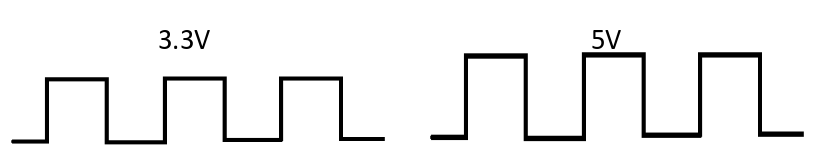

## Level shifting

Digital circuits involving microcontrollers have a signal level that they use as their "on" voltage level.

On the micro:bit, a `pin1.write_digital(1)` will set the voltage on `pin1` to `3.3V`, that's what "on" means.

But some other circuits might used a signal of `5V` to decide if something is "on". For example, the neopixel LEDs want 5V power and 5V digital signal, which the micro:bit simply can't provide either.

So what we do in this case, is use a level-shifter. In order to do this to the waveform:

The chip that does this in the labs is the 74AHCT125, which converts a `3.3V` input signal to a `5V` output signal (as shown in the diagram above). Level shifting is converting a

Level shifting can be a bit more general in that it is shifting from *any* voltage level to *any other* voltage level, but this is a good example. It is quite common the shift the other way (`5V`→`3.3V` where you might use `74LVC245` chip to do this).

### Why do we even need this?

Some devices are only designed to work at a certain voltage. A `1` might be defined as a voltage above a threshold, and if the logic level coming in is below that value, our device may not detect a `1` that we send.

If a logic level is too high, it might be a value greater than a device will accept, so you could damage the components. It's important to send a value to a device that it expects, so it's important to know the voltage of your microcontroller (on the micro:bit it is `3.3V`), and the voltage the device you are talking to expects.

For example, neopixels (WS2812B is the name of the chip), are designed to run at 5V, the reason is because extra voltage is required to produce the full range of colours from the LED (if you supply less, some colours will not be as bright, so the white looks like an off-brown).
